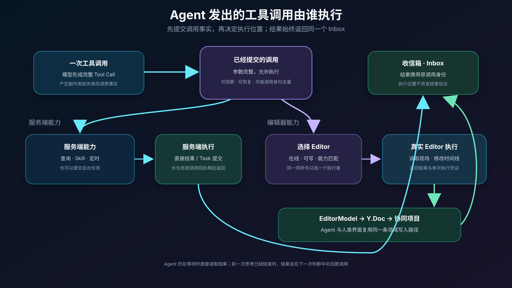
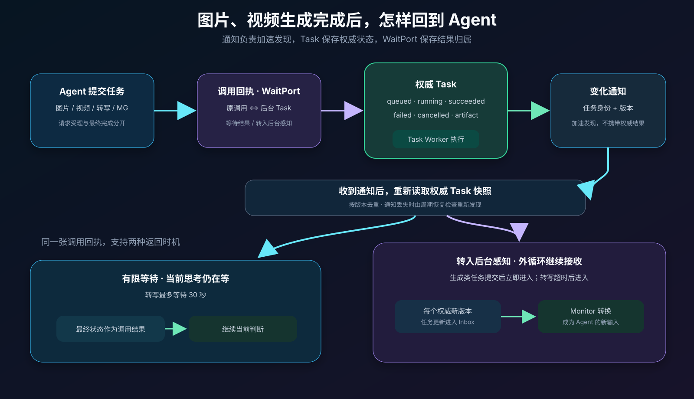
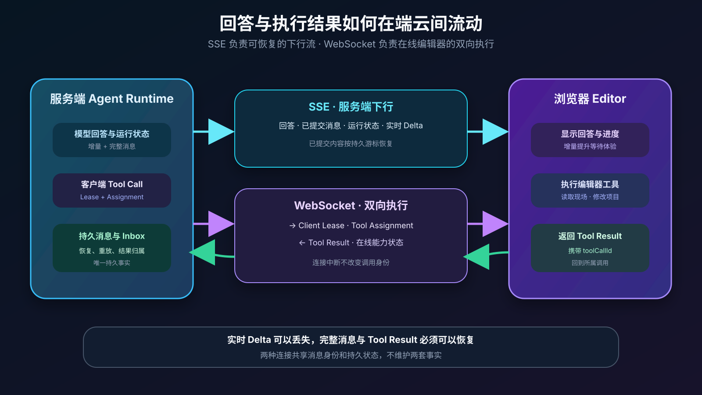
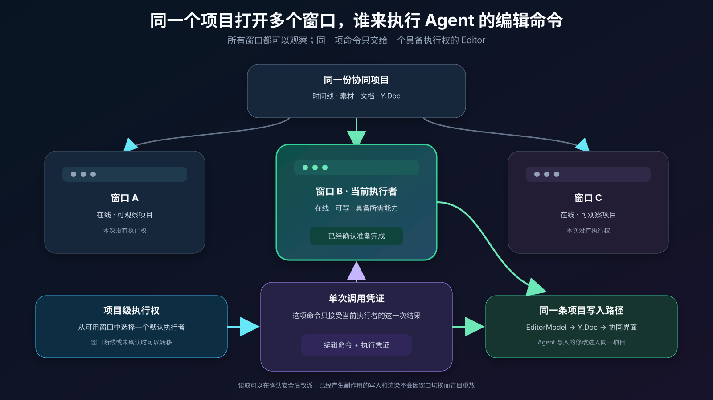
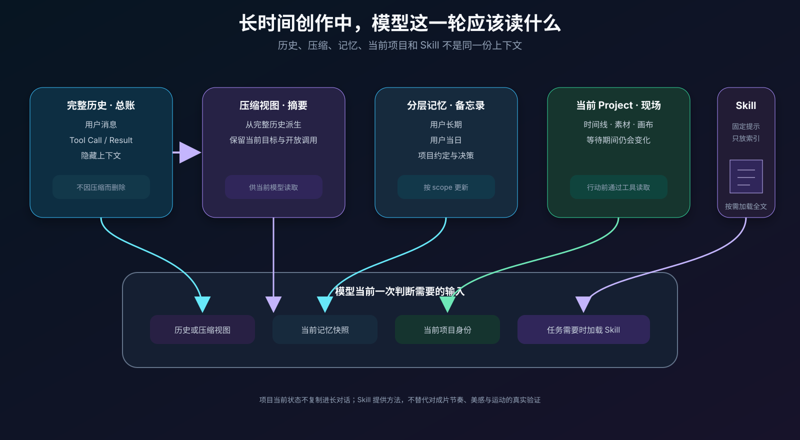

# Video Agent Loop：StarCut 面向视频创作的运行架构与实践

> 中文论文母稿。本文先完整描述 StarCut 的问题、架构和实现，再由此改写公开文章。
>
> 公开文章标题暂定：[《Video Agent Loop：StarCut 的硬核实践，DeepSeek Harness 能否满足视频场景？》](./article-agent-loop.md)
>
> 状态：架构与实验设计稿。工程耗时区间来自当前业务经验，正式发表前需要补充可复现实验数据。

## 摘要

视频创作正在从单次素材处理，转向理解、编辑与生成交替发生的持续过程。Agent 不仅需要读取项目、修改时间线和验证结果，还要等待图片、视频、音频与转写任务完成，并与用户、浏览器 Editor 及外部 Agent 共同操作一份持续变化的工程。常见的模型—工具循环可以处理一次连续推理，却不能独立回答长任务完成后如何继续、Tool Call 在客户端还是服务端执行、多个窗口如何避免重复操作、外部 Agent 如何进入同一项目，以及上下文如何在长时间创作中维持等问题。

本文介绍 StarCut 的 Video Agent Loop。系统以 Vercel AI SDK 承担一次模型与工具的连续交互，并在其外建立由持久输入驱动的业务循环。所有外部事实通过统一 Inbox 回到 Agent；不同工具可以立即交回、有限等待或等待匹配结果；Monitor sidecar 将后台 Task 更新转换成模型可消费的新输入；项目级执行租约在多个浏览器窗口中选择唯一执行者；Session Stream 与 Project Stream 分别承载对话交付和编辑器执行；MCP 将同一项目模型和领域能力开放给 Codex、Claude Code 等外部 Agent；完整历史、压缩视图、分层记忆、当前项目与按需 Skill 共同组成长期创作上下文。

本文的目标不是把 Tool Loop、Inbox、租约或后台任务分别声明为新发明，而是说明这些已有机制如何围绕视频场景收敛为一套完整运行架构。我们进一步给出并发媒体任务、异步结果回流、多窗口执行、故障恢复、上下文成本和外部 Agent 协同的实验方案，并讨论通用 Agent Harness 可以替代哪些基础能力、哪些视频业务边界仍需由创作运行时负责。

## 1. 引言

AI Coding 的成效已经说明，模型能力只有进入可读取、可行动、可反馈的环境，才能持续完成真实工作。Coding Agent 读取仓库、修改文件、运行命令和测试，再根据结果继续判断。代码仓库保存工程状态，文件和终端提供操作入口，编译器与测试反馈执行结果，人也可以随时检查和接管。

创作软件正在经历相似变化。视频 Agent 可以理解素材、生成初剪、修改时间线，也可以在项目进行到一半时补充图片、视频、旁白、字幕和 Motion Graphics。理解、生成与剪辑在同一工程中交替发生，素材集合与时间线持续变化。

这使视频 Agent 面临一组相互关联的运行问题：

- 图片和视频生成需要十几秒到数分钟，完成以后 Agent 如何自动感知并继续？
- Tool Call 有的在服务端完成，有的必须交给正在打开项目的浏览器，结果如何回到同一个模型循环？
- 回答、流式内容、客户端指令和执行结果，应该使用 SSE 还是 WebSocket？
- 同一个项目打开多个窗口时，哪一个窗口真正执行 Agent 命令？
- StarCut 内置 Agent 如何控制编辑器，Codex、Claude Code 等外部 Agent 又如何控制同一项目？
- 创作持续较长时间后，如何压缩上下文、维护记忆并按需加载 Skill？
- 网络断开、通知丢失或服务重启以后，未完成工作如何继续？

这些问题不能分别堆叠成互不相干的补丁。它们共同要求一套明确的 Agent Loop：一次模型执行能够连续使用工具，执行结束以后，用户消息、后台任务、浏览器结果和外部 Agent 行动仍能回到同一创作过程。

本文以 StarCut 的真实实现为主线，先给出完整架构，再从上述业务问题逐一展开设计。具体工作包括：

1. 区分一次模型—工具内循环与跨越异步任务、人和多个入口的外部业务循环；
2. 统一服务端、浏览器、后台 Task 和人类回答的 Tool Call 返回路径；
3. 设计异步媒体任务的等待策略与 Monitor 感知机制；
4. 设计多窗口客户端执行租约、双 Transport 和外部 MCP 项目通道；
5. 形成完整历史、压缩视图、分层记忆、项目状态与 Skill 的上下文模型；
6. 给出恢复语义、实验指标和仍需验证的创作能力边界。

## 2. Video Agent Loop 的整体架构

### 2.1 内循环：模型怎样连续完成当前工作

Agent Loop 最基本的结构是：模型判断下一步，发出 Tool Call，取得 Tool Result，再决定继续调用工具还是形成回答。

StarCut 使用 Vercel AI SDK 的 ToolLoopAgent 实现这一层。它负责模型适配、多步 Tool Calling、参数校验、流式输出、步骤上限和停止条件。一次连续思考可以搜索项目、读取文档、修改时间线、查询素材或提交后台任务，并在当前可以取得的结果基础上继续。

这一层解决的是“当前工作下一步做什么”。它并不拥有完整创作的生命周期。用户可能稍后发送新要求，媒体任务可能数分钟后完成，浏览器也可能断开后重新连接。

### 2.2 外循环：创作怎样跨越等待继续推进

外循环描述完整业务过程：

```text
用户要求
  → Agent 判断并发出工作
  → 服务端、浏览器、后台任务或人类执行
  → 新结果回到 Agent
  → Agent 读取受影响对象的当前状态
  → 继续判断和行动
```

它并不依赖一个永久存在的模型实例。持续存在的是对话历史、项目、Task、未处理输入和调用之间的因果关系。新的事实到达时，系统可以把它交给仍在进行的内循环，也可以启动下一次有限的思考。

因此，内外循环的分工是：

| 层次 | 回答的问题 | 主要输入 |
|---|---|---|
| 内循环 | 当前下一步做什么 | 模型上下文、当前 Tool Result、当前步骤间到达的新消息 |
| 外循环 | 工作回来以后如何继续创作 | 用户消息、后台 Task 更新、浏览器结果、定时事件、外部 Agent 调用 |


*图 1. 内循环完成当前判断，外循环让工作跨越执行位置、等待和人的介入重新回到创作过程。*

### 2.3 全貌中的关键部件

StarCut 的整体运行架构由以下部分组成：

| 部件 | 在业务中的责任 |
|---|---|
| 对话历史 | 保存用户要求、模型回答、Tool Call 和正式结果 |
| 项目模型 | 保存当前时间线、素材、文档和协同编辑状态 |
| 已提交消息流 | 记录 Agent 已经正式发出的内容与 Tool Call，供界面和执行器恢复 |
| Inbox | 接收尚未被 Agent 消费的用户消息、工具结果和隐藏上下文 |
| Tool 执行层 | 将调用交给服务端、浏览器、人或后台任务 |
| Task 系统 | 独立执行生成、转写等长任务，维护状态、版本和 Artifact |
| Monitor | 把后台 Task 更新转换为 Agent 的新输入 |
| 执行租约 | 在多实例和多窗口中确定唯一的有效执行者 |
| Session Stream | 向界面交付对话快照、已提交消息、模型增量和状态 |
| Project Stream | 维护 Editor 在线状态、项目级 Tool Call 和客户端执行分配 |
| MCP Project Channel | 让外部 Agent 操作项目，而不虚构内部对话 |

这些部件并不是多个平行的 Agent Loop。业务上仍然只有两个层次：一次连续思考，以及围绕同一创作不断接收新事实的外部循环。消息监听、WebSocket、恢复检查和租约续期只是交付与恢复机制。

### 2.4 四类权威状态

系统把长期事实分为四类：

| 权威状态 | 保存什么 | 不保存什么 |
|---|---|---|
| 对话 | 目标、决策、调用和结果 | 整份实时项目副本 |
| 项目 | 时间线、素材、文档和协同状态 | Agent 的临时推理 |
| Task | 请求、状态、版本、产物和失败信息 | 面向模型的自然语言总结 |
| 路由与执行权 | 结果返回关系、等待策略、当前执行者 | 第二份项目或任务状态 |

这一拆分贯穿后续所有机制：短暂计算不拥有长期事实，Agent 的历史不替代项目的现在，Monitor 不复制 Task，MCP 不维护影子工程。

## 3. Tool Call 的结果从哪里来，又怎样交回内循环

### 3.1 四类执行者

StarCut 中的 Tool Call 可能由不同执行者完成：

| 执行者 | 典型能力 |
|---|---|
| 服务端 | 查询模型、加载 Skill、准备 Library 素材、定时与任务提交 |
| 浏览器 Editor | 读取项目、局部编辑、播放、定位、抽帧、渲染 |
| Task Worker | 图片、视频、音频、MG、SVG 生成和转写 |
| 人 | 回答信息不足的问题、作出创作选择 |

模型不应该理解四套返回协议。工具定义只需声明由谁执行、是否需要写权限、可以等待多久，以及执行权丢失以后能否重试。

### 3.2 先提交 Tool Call，再交给执行者

模型流式生成参数时，浏览器可以提前显示或渐进投影，但流式片段可能中断或丢失。正式副作用必须以完整、已经提交的 Tool Call 为依据。

StarCut 在工具产生副作用前保存调用事实，并同步到已提交消息流。服务端和浏览器执行器都从这一事实取得工作。当前模型执行即使中断，开放调用仍可恢复，不依赖内存中的 Promise。

### 3.3 所有结果回到同一个 Inbox

无论执行者在哪里，结果都携带原来的 `toolCallId` 进入同一个 Inbox。用户的新消息、Monitor 形成的上下文和定时提醒也进入这一入口。

如果内循环仍在等待对应调用，结果直接推动下一步；如果当前思考已经结束，结果留在 Inbox 中，由外循环重新开始判断。执行位置不同，结果协议不分叉。

这一设计把“结果从哪里产生”与“Agent 怎样继续”分开。服务端可以更换实现，浏览器可以断线重连，Task 可以迁移 Worker，内循环仍然只消费调用身份明确的新事实。



*图 2. 执行位置与结果协议解耦。*

## 4. 图片、视频生成完成后，Agent 如何感知

### 4.1 请求受理与最终完成分离

一张图片的常见生成耗时约为 10–20 秒，一段视频约为 200–600 秒，具体时间取决于模型、队列和参数。如果 Agent 需要同时生成十张候选图，却让每次 Tool Call 等待最终产物，独立工作会被生成耗时串行阻塞。

StarCut 将长任务拆成两个业务时刻：

1. 系统接受请求，创建持久 Task，并立即返回任务身份和预期 Artifact；
2. Task 在后台排队、运行并完成，每个已经提交的权威版本随后回到外循环。

Agent 因而可以连续提交多项生成任务，后台并行执行；它还可以继续整理不依赖结果的时间线内容。当前没有可做工作时，内循环可以结束，Task 仍然继续。

### 4.2 一套协议支持三种等待策略

| 等待策略 | Agent 当下得到什么 | 适用场景 |
|---|---|---|
| 立即交回 | 请求已受理及任务身份 | 图片、视频、MG、SVG 生成 |
| 有限等待 | 限时内完成则直接得到结果，否则转入后台感知 | 当前实现中的转写，等待 30 秒 |
| 等待结果 | 必须取得匹配结果才能继续，超时作为调用失败 | 普通查询、读取和编辑工具 |

区别只是当前内循环是否等待，调用身份、结果入口和恢复方式保持一致。



*图 3. 请求受理和最终完成分开后，媒体任务可以并行执行。*

### 4.3 Task 与调用之间需要明确的返回关系

Task 是后台工作的权威事实，保存请求、状态、版本、响应和 Artifact。Task 状态先提交数据库，再发送轻量变化提示；消费者重新读取权威快照，重复、乱序或丢失提示不会成为第二份状态。

Tool Call 创建 Task 时，系统留下调用关联记录，保存原调用、Task、返回通道、等待策略和截止时间。实现中这一记录称为 WaitPort。它不是结果队列，也不保存另一份 Task，只回答“这项工作后来变化时应该怎样返回”。

### 4.4 Monitor 是后台任务的感知 sidecar

立即交回以后，原 Tool Call 已经取得“请求已受理”的正式结果。最终图片不能再次成为同一调用的第二个 Tool Result，而必须作为外部世界的新变化进入 Agent。

如果没有 Monitor，用户需要手动说“生成好了，请继续”，或者 Agent 必须主动轮询任务；让 Task 系统直接拼接模型消息，则会把 Agent 语义耦合进任务平台。

Monitor 只负责这次转换：

```text
后台 Task 更新
      ↓
Agent 可以理解的新输入
```

它从调用关联记录中找到当前对话正在关注的 Task，把 Inbox 中的版本化更新转换为隐藏上下文，并形成任务组概览。例如十张候选图中已有两张完成时，Agent 可以看到“2/10 成功、8 项仍在运行”以及已完成产物。

Monitor 不执行 Task、不拥有对话，也不维护第二份任务列表。当前实现让每个已经提交的权威 Task 版本先进入 Inbox；同一批出现多个版本时保留最新版本。是否需要控制模型继续频率，应作为调度策略评估，而不能依靠丢失任务事实实现。


*图 4. Monitor 改变表达方式，不改变 Task 的权威来源。*

### 4.5 素材回来时重新面对当前项目

等待生成期间，用户可能已经移动 Clip、替换素材或删除占位镜头。对话保存“为什么做”和原目标，当前时间线仍由项目模型维护。Agent 收到任务更新以后，延迟行动应先读取受影响对象的当前状态，再判断是使用已经完成的两张图、继续等待，还是修改原方案。

自动感知解决“Agent 是否知道结果回来”，项目工具提供当时的工程事实。能否稳定做到“先读当前状态、再应用延迟结果”仍需实验，不能只把它当作提示词约定。

> **[待补 V-M1]** 记录 Task 权威版本数、Inbox 更新数、Monitor 上下文数、任务组大小、模型继续次数和 Task 完成到 Agent 感知的延迟。

> **[待补 V-P1]** 在媒体生成期间安排人类修改目标时间线，测量 Agent 恢复后的错误覆盖率、局部修改成功率和人工接管次数。

> **[待补 V-P2]** 记录延迟任务恢复后对受影响对象的读取率，并评估是否需要版本前置条件等协议保证。

## 5. 内置 Agent 如何控制真实编辑器

### 5.1 Agent 操作项目语义，而不是屏幕坐标

StarCut 将视频工程映射为 Agent 可读取的项目视图，并通过语义化工具开放查找、读取、创建和局部编辑能力。Agent 表达的是“读取这个时间线”“修改这个对象”或“在此处加入素材”，而不是模拟鼠标拖拽。

项目状态已经由 Y.Doc 建模并支持协同。Agent 不维护另一条 AI 专用时间线，也不把整份项目复制进对话。人类界面、内置 Agent 和外部 Agent 最终进入同一领域写入路径。

### 5.2 为什么部分工具必须在浏览器执行

浏览器掌握当前 Editor、播放状态、解码渲染能力和协同项目现场。服务端适合完成查询和后台任务，读取当前时间线、局部编辑、播放、抽帧和渲染等工作则必须交给在线 Editor。

浏览器执行完成后，结果仍按原 `toolCallId` 进入 Inbox。对于内循环而言，浏览器只是另一类执行者；它不需要一套特殊的模型协议。

### 5.3 流式编辑只改善反馈，已提交调用才决定结果

当模型流式输出较长的写入内容时，浏览器可以渐进应用已收到的连续前缀，使用户尽早看到编辑过程。如果增量中断，正式提交的完整调用会补齐并完成同一次修改。

流式 Delta 是可丢失的实时反馈，已提交 Tool Call 才是权威执行输入。这条边界使渐进编辑不会破坏恢复能力。

## 6. 回答、指令和执行结果如何在两端交回

对话回答主要从服务端流向界面，客户端工具还要求服务端分配执行权、浏览器执行并回传结果。StarCut 使用两类 Transport 承担不同职责。

### 6.1 Session Stream

Session Stream 交付：

- 对话历史快照；
- 已提交消息和 Tool Call；
- 模型流式 Delta；
- token 使用和当前活动状态。

默认 Transport 是 SSE，部署需要时可以使用 WebSocket。连接可以跨越多次有限思考持续存在，重新连接只恢复读取，不会凭空启动模型。

### 6.2 Project Stream

Project Stream 使用 WebSocket，交付：

- Editor 在线与能力状态；
- 项目级执行租约；
- 客户端 Tool Call 分配、撤销与结果；
- 外部 Agent 的项目级调用。

它承担浏览器执行的双向协调，不复制对话生命周期。



*图 5. Transport 负责及时交付，持久消息与 Inbox 负责业务连续性。*

### 6.3 Transport 不拥有业务状态

SSE 与 WebSocket 回答“怎样及时送达”，不是“事实是什么”。模型 Delta 可以丢失；完整消息、Task、项目和未处理结果仍由持久状态恢复。无论结果通过 HTTP 还是 WebSocket 回传，最终都进入相同的调用结果路径。

> **[待补 V-T1]** 测量 SSE/WS 断线恢复、游标重复、增量丢失后的收敛时间，以及客户端结果回传到模型继续判断的延迟。

## 7. 同一项目打开多个窗口时怎么办

### 7.1 能看到调用，不等于有权执行

同一个项目可以同时在浏览器标签页、桌面端和其他工作窗口打开。所有窗口都能观察项目与消息，但一项带副作用的命令只能执行一次。

StarCut 从在线、具备所需能力且满足读写权限的 Editor 中选择一个默认执行者。客户端获得项目级执行租约后，还要确认自己已经准备好；没有及时确认时，系统可以选择其他窗口。

### 7.2 每项调用还有独立执行凭证

项目租约决定默认窗口，单次执行凭证决定哪一次 Tool Call 执行有效。结果回传时服务端再次校验；窗口断线后，即使旧结果迟到，也不能越过已经转移的执行权。

可安全重试的读取操作可以改派新窗口。已经开始产生不可确认副作用的写入或渲染操作不能盲目重放，应中断并重新读取项目状态。

### 7.3 多窗口中的对话与项目是两个并发层次

多个窗口打开同一段对话时，可以共同观察消息并从任一窗口发送新输入，但同一对话只允许一个活动模型执行。多个不同对话可以同时围绕同一项目思考，项目仍由 Y.Doc 协同；这能维护结构状态，却不能自动解决两个 Agent 的创作意图冲突。

因此需要区分：

- 对话级租约：避免同一段对话并行思考；
- 项目级客户端租约：避免多个窗口重复执行；
- 项目协同模型：合并结构修改；
- 任务归属与人工决定：处理更高层创作意图冲突。



*图 6. 所有窗口都可观察，同一项编辑命令只由一个有效 Editor 执行。*

> **[待补 V-C1]** 覆盖多窗口竞争、执行中断线、租约确认超时、执行权转移和旧结果晚到，记录重复副作用率、切换时间和恢复比例。

## 8. Codex、Claude Code 如何控制同一项目

### 8.1 为什么主要入口是 MCP

CLI 适合人类调试、脚本和固定流水线。对于已经拥有模型与 Tool Loop 的外部 Agent，MCP 可以直接暴露可发现的项目能力、参数和资源，并携带授权后的项目上下文。

外部 Agent 不需要共享 StarCut 的内部对话，也不需要通过远程鼠标操作画布。它需要的是绑定项目、读取项目视图、提交语义操作、启动后台任务和观察结果。

### 8.2 外部上下文绑定到项目和 Editor

每个 MCP 上下文绑定用户、组织和项目。需要浏览器能力时，还可以绑定到特定 Editor 连接。这样，同一项目中的两个外部 Agent 可以明确操作各自选择的窗口，而不是被随机分配到任意在线 Editor。

普通项目 Tool Call 进入项目消息通道，复用客户端执行租约和结果 Inbox。生成与转写等后台工作进入同一 Task 系统；外部 Agent 当前使用 `poll` 观察异步结果，因为它自己的继续机制由 MCP Host 管理。

### 8.3 共享能力，不共享对话

内置 Agent 与外部 Agent 共享：

- 项目模型与 Artifact；
- 语义化编辑工具；
- 浏览器执行通道；
- 后台 Task；
- Tool Call 与结果身份。

它们保留各自的对话、模型、上下文压缩和继续策略。入口不同，但不应形成两套项目语义和两套权威状态。


*图 7. 外部 Agent 保留自己的 Loop，StarCut 提供项目绑定、领域工具和执行通道。*

> **[待补 V-C2]** 使用同一批项目操作验证内部与外部 Agent 的结果和错误语义，并覆盖同时修改同一对象时的冲突发现与人工接管。

## 9. 如何压缩上下文、管理记忆和加载 Skill

创作可以持续数小时，但模型不应反复读取全部历史、全部项目和全部 Skill。StarCut 把模型需要的信息分成四层。

### 9.1 完整历史与压缩视图

完整对话历史保存用户消息、模型回答、Tool Call 和结果，是可追溯事实。上下文压缩只生成模型读取视图，不删除或改写原始历史。压缩本身作为持久后台任务执行，完成后通过同一 Inbox 回到后续思考。

### 9.2 分层记忆

记忆分为个人长期、个人当日和项目范围。稳定偏好进入长期记忆，短期信息进入当日记忆，项目约定和关键决策归属于项目。当前时间线仍由项目工具读取，不整体塞进记忆。

### 9.3 Skill 按需加载

初始提示只提供 Skill 名称和用途，Agent 确认需要时再加载完整内容和相关参考。Skill 可以编码剪辑流程、检查方法和案例经验，但它是否能够内化节奏感、美感与网感，必须通过实际创作任务验证。



*图 8. 不同生命周期的信息不应被压进同一份长对话。*

> **[待补 V-S1]** 建立包含节奏、信息密度、镜头连续性和平台风格的任务集，比较无 Skill、规则 Skill 和带案例 Skill 的质量、修改次数与人工接管。

## 10. 故障恢复与一致性边界

### 10.1 持久事实先于低延迟提示

新的用户消息和外部结果先进入 Inbox，再发送唤醒提示。Task 先提交权威状态，再广播变化提示。提示可以重复或丢失，周期性恢复检查从 Inbox、开放调用和 Task 状态重新发现工作。

### 10.2 消费确认晚于历史提交

Inbox 条目先进入处理中状态，只有在已经写入权威对话历史以后才确认删除。中途崩溃时，下一次执行会重新读取同一输入；消息身份和版本保证重复折叠。

### 10.3 不同租约保护不同资源

- 对话租约保证同一段对话最多一个活动模型执行；
- Task 执行凭证防止旧 Worker 继续写任务；
- 客户端执行凭证防止旧窗口提交迟到结果。

三者不能合并成一个笼统的锁，因为它们分别保护思考、后台工作和项目副作用。

### 10.4 保证的边界

系统追求持久事实最终可恢复、同一对话串行、Task 版本单调和客户端结果受执行权约束。外部生成供应商提交与本地 Task 记录、浏览器已产生但尚未回报的副作用，仍需要业务幂等键、状态重读或人工确认。本文不笼统承诺端到端 exactly-once。


*图 9. 重新判断时应读取当前项目，而不是恢复几分钟前的项目副本。*

> **[待补 V-R1]** 在消息提交、Inbox 确认、Task 提交、任务通知、Monitor 转换和执行权转移后分别终止实例，统计遗漏、重复、恢复时间和最终项目一致性。

## 11. 实验设计

### 11.1 研究问题

- **RQ1：** 立即交回和有限等待能否提高多媒体任务的并发效率？
- **RQ2：** Monitor 能否让后台结果在无人提醒的情况下稳定回到 Agent？
- **RQ3：** 多种 Tool 执行位置能否共享一致的结果语义？
- **RQ4：** 双 Transport 在断线后能否从持久状态收敛？
- **RQ5：** 多窗口执行租约能否避免重复项目副作用？
- **RQ6：** 内置 Agent 与外部 Agent 是否获得一致的项目操作语义？
- **RQ7：** 上下文压缩、记忆与 Skill 如何影响成本和创作质量？
- **RQ8：** 故障发生后，未处理输入和开放调用能否恢复？

### 11.2 对照方案

1. 长任务 Tool Call 阻塞到最终完成；
2. Tool Call 立即交回，但依赖用户再次提醒；
3. Agent 主动轮询后台任务；
4. 统一 Inbox + 调用关联记录 + Monitor；
5. 所有 Tool 都在服务端执行；
6. 服务端与真实 Editor 分工；
7. 多窗口观察到调用后各自执行；
8. 项目租约 + 单次执行凭证；
9. 外部 Agent 使用影子项目；
10. 外部 Agent 复用真实项目模型和 Editor。

### 11.3 工作负载与指标

| 场景 | 主要指标 |
|---|---|
| 1、5、10、20 项并发生成 | 请求受理延迟、全部完成时间、同时活跃 Task 数 |
| Task 进度与完成回流 | Agent 感知延迟、需要用户提醒次数、模型继续次数、token |
| 服务端与浏览器 Tool | 结果延迟、错误语义一致性、恢复率 |
| SSE/WS 断线重连 | 游标重复、增量丢失后的收敛时间 |
| 多窗口执行 | 重复副作用、旧凭证拒绝、执行权切换耗时 |
| 人和 Agent 并行修改 | 错误覆盖率、冲突发现率、人工接管率 |
| MCP 外部调用 | 项目操作一致性、异步结果可观察性 |
| 压缩、记忆与 Skill | 上下文 token、完成质量、返工次数 |
| 通知丢失与实例终止 | 遗漏结果、重复结果、恢复率和恢复时间 |

## 12. 局限与待解决问题

Video Agent Loop 解决的是持续感知、可靠行动和多入口协同，不直接保证创作质量。AI Cut 与 Human Cut 的差距仍然体现在节奏、美感、镜头运动、叙事意图和平台风格的理解上。Skill 可能沉淀部分方法，但需要实践验证。

当前实现让每个权威 Task 版本进入 Inbox。任务更新频率提高以后，怎样在不丢事实的前提下控制模型继续次数，仍需实验。

Y.Doc 可以维护结构一致性，却不能自动解决多个 Agent 的创作意图冲突。需要进一步研究任务归属、版本策略和人工裁决。

当所有 Editor 离线时，必须依赖浏览器现场的工具无法立即执行。系统可以保存调用或返回明确状态，但不能假装服务端拥有同一编辑环境。

## 13. 相关工作

[ReAct](https://arxiv.org/abs/2210.03629) 研究模型如何交错推理与行动，对应本文的内循环。本文进一步关注结果跨越当前模型执行后，怎样进入持续业务循环。

Orleans Virtual Actor、Azure Durable Functions、Temporal、event sourcing 和消息驱动系统研究持久状态、顺序执行和故障恢复。本文复用这些基础原理，讨论它们与模型步骤、媒体产物、浏览器执行权和协同项目的结合。

[SWE-agent](https://arxiv.org/abs/2405.15793) 强调 Agent-Computer Interface 对 Agent 行为的影响；[OSWorld](https://arxiv.org/abs/2404.07972) 展示通用 GUI Agent 的现实困难；[AgenticVBench](https://arxiv.org/abs/2605.27705) 开始评估后期制作任务中的工具使用和失败模式。StarCut 同样选择稳定的项目语义，而不是屏幕坐标。

MCP 提供外部 Agent 与工具的标准接口和异步任务扩展。本文关注的是如何把 MCP 桥接到一份由人、内置 Agent 和多个窗口共同维护的视频工程。

[DeepSeek Harness](https://github.com/deepseek-ai/deepseek-harness) 的插件化模型适配、Tool Pipeline、Agent Loop、Session Event Log、统一 Inbox、Background Jobs 和 Compaction，与 StarCut 的通用模型运行层存在重合。后续可用相同的视频工作负载检验它是否减少模型适配、工具管线、完整历史与上下文压缩的实现复杂度；媒体 Task—Artifact 关系、任务组感知、浏览器执行权、MCP 项目绑定和 Y.Doc 协同仍属于视频业务运行时的研究范围。

> **[待补 V-H1]** 用同一批 Tool Calling、并发生成、上下文压缩和浏览器执行任务，对比现有实现与 Harness 插件实现的适配代码量、重复状态源、延迟和故障覆盖。

> **[待补 V-L1]** 补充 virtual actor、durable execution、transactional outbox、event sourcing、lease scheduling 和 human-in-the-loop workflow 的论文或正式技术报告，逐项说明本文复用的已有原理。

## 14. 结论

StarCut 的 Video Agent Loop 不是一条无限运行的模型循环，而是一套围绕持续创作组织起来的运行架构。Vercel AI SDK 负责当前模型与工具的连续交互；Inbox 让用户、服务端、浏览器和后台任务的结果回到同一入口；等待策略与 Monitor 让长媒体任务不阻塞当前工作；项目模型为迟到结果提供当时的工程事实；双 Transport 连接对话交付与浏览器执行；租约避免多实例和多窗口重复行动；MCP 让外部 Agent 复用同一项目能力；压缩、记忆和 Skill 则维持较长创作中的上下文。

这些机制分别对应视频创作中实际发生的问题，又通过少数权威状态收敛在同一业务循环中。后续实验需要验证它们是否真正改善并发效率、自动续作、恢复能力和协同正确性，也需要继续评估通用 Harness 能否减少 StarCut 的基础运行代码，而不模糊视频业务边界。

## 参考文献（首轮）

1. S. Yao et al., [ReAct: Synergizing Reasoning and Acting in Language Models](https://arxiv.org/abs/2210.03629), 2022/2023.
2. Vercel, [AI SDK: ToolLoopAgent](https://ai-sdk.dev/docs/reference/ai-sdk-core/tool-loop-agent).
3. DeepSeek AI, [DeepSeek Harness](https://github.com/deepseek-ai/deepseek-harness), developer preview, 2026.
4. DeepSeek AI, [DeepSeek Harness Architecture](https://github.com/deepseek-ai/deepseek-harness/blob/master/docs/architecture.md), 2026.
5. J. Yang et al., [SWE-agent: Agent-Computer Interfaces Enable Automated Software Engineering](https://arxiv.org/abs/2405.15793), 2024.
6. T. Xie et al., [OSWorld: Benchmarking Multimodal Agents for Open-Ended Tasks in Real Computer Environments](https://arxiv.org/abs/2404.07972), 2024.
7. Z. Cao et al., [AgenticVBench: Can AI Agents Complete Real-World Post-Production Tasks?](https://arxiv.org/abs/2605.27705), 2026.
8. P. Bernstein et al., [Orleans: Distributed Virtual Actors for Programmability and Scalability](https://www.microsoft.com/en-us/research/publication/orleans-distributed-virtual-actors-for-programmability-and-scalability/), Microsoft Research Technical Report, 2014.
9. Microsoft, [Durable Functions Overview](https://learn.microsoft.com/en-us/azure/durable-task/durable-functions/durable-functions-overview).
10. Temporal Technologies, [Temporal Documentation](https://docs.temporal.io/).
11. Model Context Protocol, [Tasks Overview](https://modelcontextprotocol.io/extensions/tasks/overview).
12. **[待补 V-L1]** Transactional outbox、event sourcing、lease scheduling 与 human-in-the-loop workflow 的系统论文。
