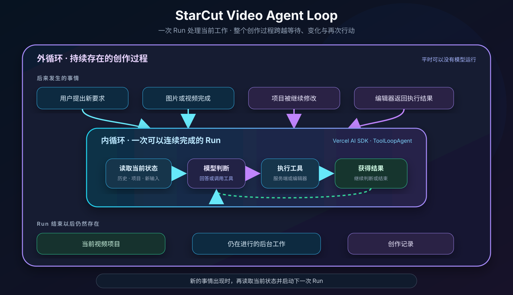
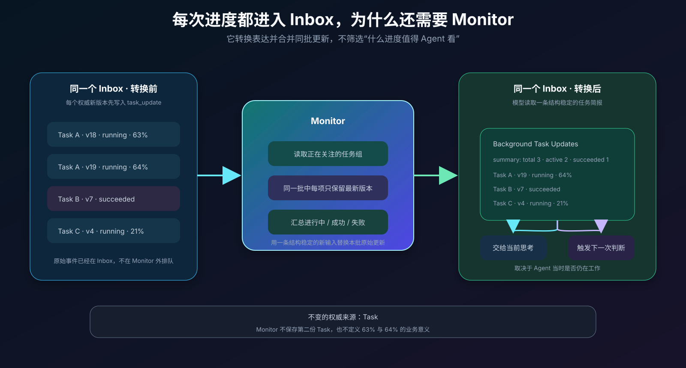
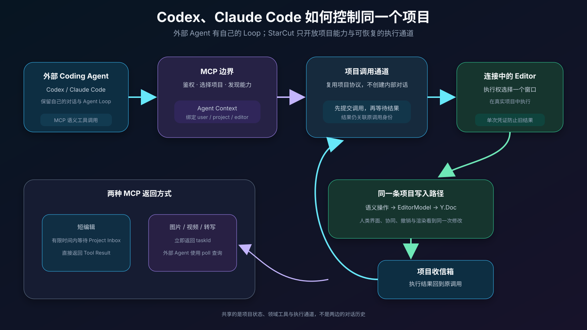
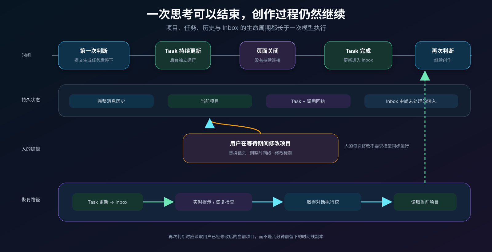

# Video Agent Loop：StarCut 的硬核实践，DeepSeek Harness 能否满足视频场景？


## 引言

AI Coding 从代码补全走向 Coding Agent，背后是一套能够持续工作的 Agent Loop：模型读取仓库、修改文件、运行命令和测试，再根据结果继续下一步。代码仓库为这个循环提供了成熟的工作环境：源文件表达工程状态，文件与终端提供稳定入口，编译器和测试返回执行反馈，人也可以随时检查并接管同一份工程。

创作软件正在经历相似的变化。[Descript](https://www.descript.com/underlord)、[ChatCut](https://chatcut.io/docs/what-is-chatcut) 等产品已经开始让 Agent 理解素材、生成初剪，并通过自然语言修改时间线。生成能力也进入了同一条工作流：一条产品视频做到一半，可能发现缺少合适的产品特写，于是临时生成图片，再把图片扩展为几秒钟的动态镜头；旁白、音乐、字幕和 Motion Graphics 也会陆续补充。剪辑、理解和生成在同一个项目中交替进行，素材集合与时间线都在持续变化。

新的工作方式也带来了一组问题。图片和视频生成需要十几秒到几分钟，生成完成后，Agent 如何感知结果并继续创作？等待期间用户可能已经调整过时间线，返回的素材又该怎样进入当前项目？除了 StarCut 内置 Agent，Codex、Claude Code 等外部 Agent 也可能操作同一个工程，不同入口如何共享项目状态并协调行动？浏览器掌握编辑现场，服务端负责模型调用和媒体任务，回答、指令与执行结果如何在两端之间持续传递？

围绕这些问题，StarCut 已经形成了一套连接媒体生成、项目协同、分布式调度和浏览器执行的完整 Video Agent Loop。近期 DeepSeek Harness 的讨论让 Agent Harness 再次受到关注。这套现成的业务链路正好提供了一组检验题：DeepSeek Harness 是否解决了这些问题，插件化设计能否减少系统复杂度。

## 一、Video Agent Loop 的整体架构

先从最小的 Agent Loop 说起。模型收到上下文以后给出回答，也可能调用一个工具；工具返回结果，模型再决定下一步。这个“模型—工具—结果—模型”的往复，就是一次 Agent 执行最核心的循环。

StarCut 当前使用 Vercel AI SDK 7 的 `ToolLoopAgent` 运行这部分工作。它已经提供了多步 Tool Calling、流式输出、停止条件和逐步调整上下文等基础能力。[Vercel AI SDK 对 ToolLoopAgent 的定义](https://ai-sdk.dev/docs/reference/ai-sdk-core/tool-loop-agent)与我们的内循环需求比较接近：模型可以连续调用工具、观察结果，再决定继续或结束；`stopWhen` 和 `prepareStep` 让宿主在每一步之间控制停止条件和新输入。[Loop Control](https://ai-sdk.dev/docs/agents/loop-control)

我们选择它，主要基于四点：

- **模型与运行逻辑分开。** StarCut 可以通过统一模型层选择不同供应商，Agent Loop 不跟某一家模型的消息格式绑定。
- **工具调用已经形成稳定的多步循环。** 参数校验、Tool Call、Tool Result 和下一次模型调用沿用 SDK 语义，产品层只补充视频工具和执行策略。
- **消息可以贯穿模型与界面。** StarCut 使用 `UIMessage` 保存文本、工具调用、结果和元数据，再把其中适合模型读取的部分转换成 Model Message。AI SDK 将 `UIMessage` 定义为面向应用状态的完整消息表示。[UIMessage](https://ai-sdk.dev/docs/reference/ai-sdk-core/ui-message)
- **流式输出与完整结果可以同时保留。** 用户先看到文字和工具参数逐步出现，运行结束后系统再保存完整消息。

这部分解决的是一次 Agent Run 内部的工作。视频生成可能在几分钟后完成，用户会在等待期间修改项目，浏览器也会断开和重连；这些事实跨越了当前 `ToolLoopAgent` 的生命周期。StarCut 在 SDK 之上继续实现了持久 Session、统一 Inbox、媒体 Task、Monitor、执行权和客户端调度。

在这层基础上，StarCut 把 Video Agent Loop 分成内外两层。内循环处理当前这次能够连续完成的工作，外循环承接稍后才会发生的事实。

### 内循环：完成当前这次工作

一次 Session Run 会创建一个短暂的 Agent Process，其中运行一个 `ToolLoopAgent`：

```text
读取已提交消息与项目上下文
  → 模型判断下一步
  → 调用服务端工具或客户端工具
  → 接收 Tool Result
  → 模型继续判断
  → 保存完整 UIMessage
```

内循环可以包含多次模型调用和多次工具执行。运行中的用户补充也可以在步骤之间进入上下文。当前工作完成、需要等待外部结果或达到停止条件以后，这次 Run 结束。

### 外循环：接住后来发生的事实

Session 和项目的生命周期比一次 Run 更长。后续输入统一进入 Inbox：

- 用户发来的新消息；
- 系统补充的隐藏上下文；
- 服务端或浏览器返回的 Tool Result；
- 视频、图片和转写任务产生的 Task Update。

WaitPort 保存“某个结果属于哪次工具调用”的关系；Monitor 把高频任务变化整理成 Agent 可以判断的上下文；Clock 负责明确的时间事件；Run Lease 保证同一个 Session 同时只有一个执行者。Inbox 中出现可处理的新事实后，外循环再启动一次内循环。



*内循环可以结束，创作过程继续存在；新的事实通过外循环进入下一次判断。*

这里有三份需要始终分清的状态：Session 保存对话和工具执行历史，Task 保存媒体工作的权威状态，项目模型保存当前视频工程。它们通过身份和版本建立关系，各自维护自己的事实。

按 StarCut 的现有架构拆开看，DeepSeek Harness 可以对应模型—工具内循环，并提供 Session、插件和上下文压缩等 Runtime 能力。若做接入实验，边界会先放在一次 Session Run 内，验证它能否在保持现有行为的同时减少系统概念和适配代码。媒体 Task、Monitor、项目状态和客户端调度继续由外循环承接。

## 二、视频、图片生成完成后，Agent 如何感知

在当前常见的生成链路里，一张图片通常需要 10–20 秒，一段视频大约需要 200–600 秒，具体时间还会受到模型、队列和生成参数影响。用户发出“生成三张产品图，再选两张做开场”以后，Agent 很快就会遇到几个实际选择：三张图能否并行生成，这几分钟还能不能继续工作，一张图先回来时要不要立即判断，以及本次模型执行结束后谁来接收结果。

StarCut 把生成请求提交给持久 Task。每项任务独立进入对应队列，Worker 按队列容量并行执行。Agent 可以继续完成不依赖生成结果的工作；当前已经没有其他工作时，这次 Run 便正常结束，不占用一个模型调用或进程原地轮询。

即使图片可能在 10–20 秒内完成，StarCut 当前仍让生成类任务在提交后立即进入 Monitor。这样，Agent 可以继续组织脚本、查找素材或提交其他生成请求。转写等结果紧接着就要使用的任务保留 30 秒有限等待；超出窗口以后，同样交给 Monitor。两种路径共用 WaitPort：

```text
Agent 提交任务
  → 建立 Tool Call 与 Task 的等待关系
  → Task Worker 在后台执行
  ├─ 生成任务：立即交给 Monitor，Agent 继续或结束当前 Run
  └─ 有限等待任务
       ├─ 结果先到：回到当前 Run
       └─ 截止时间先到：转给 Monitor
  → Monitor 整理后续变化，外循环启动新的 Run
```

生成服务发出的通知只提示“这项任务可能变了”。接收方会重新读取权威 Task，并按版本处理重复、延迟或乱序通知。这样，最终结果留在 Task 中，通知丢失以后也可以通过恢复扫描重新发现。

### 进度每次变化都要告诉 Agent 吗

界面需要把 63% 到 64% 的变化展示给用户，Agent 的下一步通常不会随这 1% 改变。Monitor 观察当前 Session 真正等待的任务组，保留每项任务的最新状态，再把一批变化压缩成一条上下文。值得重新判断的情况通常包括：

- 某项任务失败，需要重试或更换方案；
- 一部分结果已经足够开始后续工作；
- 整组任务全部完成；
- 用户设定的检查点或截止时间到达。



*UI 跟随连续进度，Agent 跟随决策条件。*

<!-- [研发待补 A-M1] 按图片、视频、转写分别记录 Task 耗时的 P50/P95、并发度、原始更新数、Monitor 上下文数、模型唤醒数和端到端继续时延。当前 10–20 秒与 200–600 秒为常见业务区间，正式发布前补真实样本分布。 -->

## 三、等待过程中，人还在编辑项目

素材生成期间，用户可能已经替换了镜头、修改了标题，甚至重新安排了开场。等 Agent 再次工作时，开始生成任务那一刻的项目快照已经过期。

StarCut 将 Session 和项目模型分开。Session 保存目标、消息、工具调用和必要引用；时间线、素材和画布结构由项目模型持续维护。用户的编辑直接进入项目，Agent 每次重新行动前也从项目模型读取当前结构。

```text
收到新的生成结果或用户要求
  → 读取当前项目
  → 定位需要修改的对象
  → 提交局部语义操作
  → 项目模型验证并更新状态
```

用户对项目的直接修改和用户对 Agent 的补充要求走两条不同路径。前者已经体现在工程中，后者进入 Session；下一次 Run 同时读取两者。Agent 继续先前计划时，会以当前项目为起点，只保留仍然适用的部分。

这一结构也允许人随时接管。用户手动换掉 Agent 选择的一张图以后，Agent 后续看到的就是换过的版本，不需要额外把人的选择同步回某个 Agent 私有工程。

<!-- [研发待补 A-P1] 建立生成等待期间的协同编辑任务集，验证 Agent 重启后读取最新项目、局部修改不覆盖人的选择，并记录人工接管前后的完成率。 -->

## 四、Agent 如何控制视频编辑器

模型需要先理解视频项目，再表达它要做的修改。StarCut 给 Agent 提供虚拟文件视图和语义化编辑工具：它可以查找素材、读取时间线、定位对象，再提交局部编辑。虚拟文件只是 AI 视图，所有操作最终仍落在运行中的项目模型上。

这部分架构已经在 [《Edit Video as Code：将视频工程映射为 Coding Agent 可读写的虚拟文件视图》](./article-edit-video-as-code.md) 中详细展开。本文只保留它与 Agent Loop 相关的执行边界。

一次 Tool Call 在哪里执行，由工具依赖的状态决定：

- 模型查询、素材检索、任务提交和时间调度可以在服务端完成；
- 读取当前编辑器状态、修改时间线、提取当前帧和渲染预览等操作交给连接中的客户端；
- 长时间的生成、转写和其他后台工作进入持久 Task，由 Worker 执行。

客户端工具没有另建一套编辑 API。浏览器收到调用后，使用人类界面相同的领域写路径更新项目，因此协同、撤销、验证和渲染看到的是同一次修改。服务端负责工具身份、调用关联和结果运输，编辑器负责解释当前项目中的具体动作。

## 五、如何让 Codex、Claude Code 控制 StarCut

产品内的 Agent 已经知道当前 Session 和项目；Codex、Claude Code 等外部 Coding Agent 则需要一个公开入口，先发现能力，再选择项目并发起编辑。

CLI 适合人在终端中调试、编写脚本和组合固定流程。MCP 更适合作为 Agent 集成协议：工具、资源和参数可以被发现，调用也能携带明确的项目上下文。StarCut 因此把 MCP 作为外部 Agent 的主要入口，并把画布、时间线和媒体任务表达成领域能力，而非屏幕坐标。

外部 Agent 发出的短小编辑可以直接返回；视频生成、转写等后台工作返回可以继续查询的 Task。MCP 的 [Tasks 扩展](https://modelcontextprotocol.io/extensions/tasks/overview) 可以承载跨调用生命周期，协议中的 Task 则映射到 StarCut 已有的权威 Task。

内部 Session Tool 和外部 MCP Tool 使用不同入口，却共用同一套调用运输：Message Stream 记录调用，WaitPort 关联结果，浏览器执行需要客户端能力的操作。外部调用使用 Project Channel，不必创建一段虚构对话；内部 Agent 继续使用带对话生命周期的 Session Channel。



*外部 Coding Agent、产品内 Agent 和人类编辑器最终操作同一份项目状态。*

<!-- [研发待补 A-C1] 固定 MCP 短调用与长 Task 的状态、版本、取消、超时和输出映射；使用同一批项目操作验证内部 Agent 与外部 Agent 的结果和错误语义。 -->

## 六、同一项目打开多个窗口时怎么办

同一个项目可能同时出现在桌面端、浏览器标签页和另一个工作窗口中。它们都可以观察项目，一条编辑命令却只能产生一次有效执行。

Client Lease Coordinator 会从在线、可写且具备所需能力的 Editor 中选择执行者。服务端发送的 Tool Assignment 带有执行身份，浏览器确认 Lease 后开始工作，返回结果时再次校验身份。

执行窗口中途断开后，读取类操作可以交给新的窗口重试；已经开始产生副作用的写操作会中断，再由上层决定下一步。旧窗口恢复连接后，即使带回迟到结果，也无法越过已经变化的执行身份。

这里同时存在两种 Lease：Run Lease 选择推进 Session 的 Worker，Client Lease 选择执行当前编辑命令的浏览器。它们分别解决服务端并发和客户端并发，最终通过同一个 Tool Call 身份汇合。

<!-- [研发待补 A-C2] 覆盖无在线 Editor、执行中断线、Lease 转移、旧结果晚到和响应已提交但客户端未收到等场景，验证写操作没有重复副作用。 -->

## 七、回答和执行结果如何交回去

Agent 的文字回答需要持续传给浏览器，浏览器执行工具以后又要把结果交回 Agent。两种方向共享同一套消息和调用身份，但对连接的要求不同。

StarCut 同时保留 SSE 和 WebSocket：

- SSE 负责把已提交消息、运行状态和模型增量持续发送给客户端，断线后可以从持久游标继续；
- WebSocket 除了读取同一事件流，还能双向传递客户端 Lease、Tool Assignment 和 Tool Result。

实时 Delta 用来降低等待感，可以在断线时丢失；完整 `UIMessage` 会在一次 Run 完成后持久化，再作为恢复和重放的依据。浏览器错过一段增量后，后续完整消息会把界面校正到已提交状态。

客户端 Tool Result 先按 `toolCallId` 进入 Inbox。当前 Run 仍在等待时，结果直接推动下一次模型 Step；当前 Run 已经结束时，同一结果会触发后续 Run。连接形式不会改变这条结果路径。

<!-- [研发待补 A-T1] 测量 SSE 与 WebSocket 的断线恢复时间、游标重复率、Delta 丢失后的收敛时间，以及客户端结果从提交到进入下一次模型判断的延迟。 -->

## 八、上下文压缩与记忆

Session 持续变长以后，完整历史需要保存，模型每一步实际读取的内容则需要控制规模。StarCut 将这几类信息分开：

- **Session 历史**记录对话、工具调用和执行结果；
- **上下文压缩**把较早历史整理成模型可以继续使用的摘要；
- **用户长期记忆**保存稳定偏好和个人事实；
- **用户当日记忆**保存当天仍然有效的背景；
- **项目记忆**保存项目约定、创作决定和原因；
- **项目模型**保存时间线、素材和画布当前是什么。

压缩不会删除原始历史，它生成一个新的模型读取视图。记忆也采用完整快照，并携带来源边界；后台生成期间如果源内容已经变化，较旧结果不能覆盖新的状态。当前 Editor 状态只投影到模型输入，不会作为聊天消息永久复制。

在上下文治理这一部分，DeepSeek Harness 给出了一套清楚的 Session Event Log 和 Compaction 实现：模型消息由事件日志派生，压缩过程显式记录开始、摘要和结束。[Session](https://github.com/deepseek-ai/deepseek-harness/blob/master/docs/subsystems/session.md)、[Compaction](https://github.com/deepseek-ai/deepseek-harness/blob/master/docs/subsystems/compaction.md) 这部分可以进入 StarCut 的替换实验，项目记忆和视频工程状态仍按现有边界保留。

<!-- [研发待补 A-X1] 用长 Session 比较压缩前后 token、目标保持率、Tool Call/Result 配对完整性和恢复时间；分别评估用户长期、用户当日与项目记忆的命中和污染。 -->

## 九、浏览器断开或服务重启后如何继续

用户关闭页面、网络中断或服务滚动升级时，当前执行进程可能消失。下一次执行需要知道已经发生了什么、哪些输入还没有处理，以及哪个任务仍在等待。

每次 Session Run 都从已提交历史和 Inbox 开始：

```text
恢复完整消息
  → 领取 Inbox 输入
  → 读取当前项目上下文
  → 运行模型与工具
  → 持久化完整结果
  → 确认本批输入
```

输入在结果持久化以后才被确认。进程提前退出时，未确认输入会再次出现；结果已经保存但确认尚未完成时，下一次 Run 根据消息身份折叠重复内容。

多个 Worker 可能同时发现同一个 Session 有新工作。Run Lease 选出唯一执行者，并在运行期间续约。旧 Worker 失去执行权以后无法继续提交结果。恢复扫描定期检查非空 Inbox、到期时间事件、WaitPort 和权威 Task，因此瞬时通知只影响响应速度，不决定任务是否最终被发现。



*Session、Task 和项目持续存在，执行它们的 Process 可以结束并重建。*

<!-- [研发待补 A-R1] 在消息持久化、Inbox 确认、Task 完成、Lease 转移和客户端结果提交等边界注入故障，记录恢复延迟、重复执行和遗漏结果。 -->

## 十、Skill 如何接入 Agent Loop

视频剪辑经验可以整理成 Skill，例如开场节奏检查、口播与画面对齐、字幕安全区、产品镜头选择和 Motion Graphics 制作流程。Skill 的职责是为当前任务补充方法和约束，实际行动仍通过已有工具完成。

StarCut 在静态 System Prompt 中只保留 Skill 的名称和简介。Agent 判断当前任务需要某项指导时，通过 `load_skill` 读取完整内容；同一份内容在一次 Run 中只加载一次。现在的 Skill 包括时间线编辑、图形、媒体生成和转写等领域。

```text
System Prompt 中的 Skill 索引
  → Agent 按当前任务选择
  → 加载完整 Skill 或其中一份参考
  → 使用现有 Tool 完成工作
  → 通过项目结果和人的选择验证
```

这种按需加载控制了固定上下文大小，也让经验与工具协议保持分离。Skill 是否能稳定改善节奏感、美感、运动感和网感，还需要真实成片实验；流程写得完整，只能说明方法可以被复用，无法预先证明创作质量。

<!-- [研发待补 A-Q1] 建立包含节奏、信息密度、运动连续性、主体突出和风格一致性的真实任务集，对比无 Skill、流程 Skill、视觉反馈和人工中途介入。 -->

## 相关工作

[ReAct](https://arxiv.org/abs/2210.03629) 讨论推理与行动如何交错，对应一次 Agent Run 内的模型—工具迭代。[Orleans 的 Virtual Actor](https://www.microsoft.com/en-us/research/publication/orleans-distributed-virtual-actors-for-programmability-and-scalability/)、[Azure Durable Functions](https://learn.microsoft.com/en-us/azure/durable-task/durable-functions/durable-functions-overview) 和 [Temporal](https://docs.temporal.io/) 展示了另一类长期积累：长生命周期实体可以依靠持久状态、调度和恢复跨越进程。

[SWE-agent](https://arxiv.org/abs/2405.15793) 强调 Agent-Computer Interface 会影响软件工程 Agent 的行为；[OSWorld](https://arxiv.org/abs/2404.07972) 展示了通用 GUI Agent 在真实计算机环境中的视觉定位和操作困难；面向后期制作任务的 [AgenticVBench](https://arxiv.org/abs/2605.27705) 则开始把执行框架、工具使用和失败方式带入视频 Agent 评估。

StarCut 的 Video Agent Loop 将这些问题放进同一条视频创作链路：Vercel AI SDK 运行模型与工具的当前循环，持久 Task 和 Monitor 承接媒体结果，项目模型保存视频工程，MCP 和浏览器执行让不同 Agent 作用于真实项目。

## 结语

回到开头的十秒视频：Agent 提交三项生成任务以后可以继续整理项目，也可以结束当前 Run；图片回来时，Monitor 把结果送入后续判断；用户在等待期间做出的修改已经留在项目中；新的编辑命令由当前有效的浏览器执行；窗口或服务中断以后，同一条创作链路沿着持久记录继续。

这就是 StarCut 对 Video Agent Loop 的理解。内循环负责一次模型能够连续完成的工作，外循环负责创作过程中后来发生的事实。Inbox、WaitPort、Monitor、Run Lease、MCP Canvas、SSE、WebSocket 和 Client Lease 都服务于这条链路中的具体问题。

用 StarCut 的业务链路来检验，DeepSeek Harness 当前公开的能力主要覆盖通用 Agent Loop、Session 和上下文治理，可以成为内循环的候选实现。媒体任务的持续感知、用户与 Agent 共用的项目状态、多窗口调度和浏览器执行仍然由 StarCut 的视频运行时处理。接入是否成立，取决于它能否在完整保留这些业务能力的前提下，真正减少系统概念和维护成本。

## 相关资料

1. Vercel, [AI SDK: ToolLoopAgent](https://ai-sdk.dev/docs/reference/ai-sdk-core/tool-loop-agent).
2. Vercel, [AI SDK: Loop Control](https://ai-sdk.dev/docs/agents/loop-control).
3. Vercel, [AI SDK: UIMessage](https://ai-sdk.dev/docs/reference/ai-sdk-core/ui-message).
4. DeepSeek AI, [DeepSeek Harness](https://github.com/deepseek-ai/deepseek-harness), developer preview, 2026.
5. DeepSeek AI, [DeepSeek Harness Architecture](https://github.com/deepseek-ai/deepseek-harness/blob/master/docs/architecture.md), 2026.
6. S. Yao et al., [ReAct: Synergizing Reasoning and Acting in Language Models](https://arxiv.org/abs/2210.03629), 2022/2023.
7. P. Bernstein et al., [Orleans: Distributed Virtual Actors for Programmability and Scalability](https://www.microsoft.com/en-us/research/publication/orleans-distributed-virtual-actors-for-programmability-and-scalability/), Microsoft Research Technical Report, 2014.
8. Microsoft, [Durable Functions Overview](https://learn.microsoft.com/en-us/azure/durable-task/durable-functions/durable-functions-overview).
9. Temporal Technologies, [Temporal Documentation](https://docs.temporal.io/).
10. Model Context Protocol, [Specification 2026-07-28](https://modelcontextprotocol.io/specification/2026-07-28).
11. Model Context Protocol, [Tasks Overview](https://modelcontextprotocol.io/extensions/tasks/overview).
12. J. Yang et al., [SWE-agent: Agent-Computer Interfaces Enable Automated Software Engineering](https://arxiv.org/abs/2405.15793), 2024.
13. T. Xie et al., [OSWorld: Benchmarking Multimodal Agents for Open-Ended Tasks in Real Computer Environments](https://arxiv.org/abs/2404.07972), 2024.
14. Z. Cao et al., [AgenticVBench: Can AI Agents Complete Real-World Post-Production Tasks?](https://arxiv.org/abs/2605.27705), 2026.
15. Descript, [Underlord: Your AI Video & Podcast Editing Assistant](https://www.descript.com/underlord).
16. ChatCut, [What is ChatCut?](https://chatcut.io/docs/what-is-chatcut).
