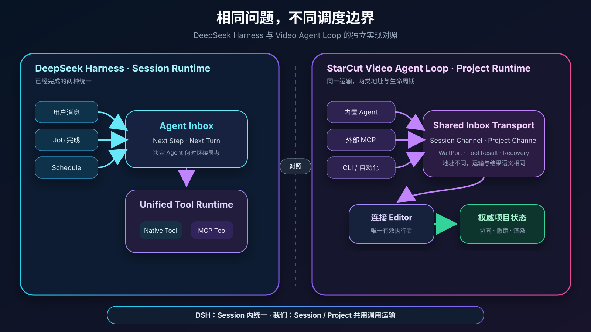

# Video Agent Loop：StarCut 的硬核实践，DeepSeek Harness 能否满足视频场景？


> 创作软件里的 Agent 工作在一段持续变化的过程中：素材会晚一些回来，人会随时修改项目，执行窗口可能切换，连接也可能中断。本文以 StarCut 的实现为主线，讨论怎样让 Agent 在这些变化中继续感知和行动，并对照 DeepSeek Harness 的能力边界。

## 引言：创作工具里的 Agent Loop

做视频时，很少有人说完一句需求，就在几分钟后直接拿到成片。更常见的过程是整理素材，搭出一个版本，播放几遍，再调整镜头、节奏和文字。图片、视频、配音等生成任务穿插其中，创作者一边等待，一边继续修改项目。

Agent 进入创作工具后，也要参与这段持续的过程。它会读取项目、寻找素材、发起生成、修改时间线和检查结果。一次模型调用只覆盖其中一小段，许多事情会在这次调用结束后继续发生。

比如，用户让 Agent 生成三张产品图，选出两张做一个十秒开场。生成请求提交后，Agent 暂时没有更多工作；等待图片的几分钟里，用户改了标题，又在另一个窗口打开项目。等图片陆续回来，Agent 要接着原来的目标工作，也要接受项目在这段时间里已经发生的变化。随后发出的编辑命令，还要找到当前真正持有项目状态的浏览器。

我们把 Agent Loop 的边界放到了整个创作过程：当前能够连续完成的推理和工具调用形成内循环；稍后到达的生成结果、用户要求和客户端返回进入外循环。Inbox、WaitPort、Monitor、Run Lease、MCP Canvas 和客户端执行调度，分别接住这条链路上的消息、等待、恢复和行动。

DeepSeek Harness 发布后，我们也重新检查了这套实现。它在 Agent Loop、Session、工具执行和上下文压缩上提供了很完整的通用能力，与 StarCut 有不少相似选择；到了媒体任务、浏览器 Editor 和项目协作这些位置，两套系统的边界开始不同。

下面先沿着 StarCut 的创作链路讲实现，最后再集中讨论 DeepSeek Harness 可以接在哪一层。

## 一、一段创作里的两种节奏

一次连续执行里，Agent 可以读取项目、选择素材、修改时间线、查看结果，再继续修正。素材生成把工作带到几分钟甚至更久以后；人类编辑和外部 Agent 又让同一个项目同时拥有多个行动入口。

这个过程同时存在两种节奏：

- **内循环**完成当前能够完成的工作：理解上下文、调用工具、检查结果，直到完成或暂时没有下一步；
- **外循环**关注后来发生的事实：新的用户要求、生成结果、时间事件和客户端返回，并在需要时启动下一次内循环。

一次内循环对应一个有边界的 Session Run，完成当前工作后便可以结束。Session 和项目继续存在。Monitor 整理后来出现的变化，MCP Canvas 接收外部 Agent 的语义操作，外循环在条件具备时启动下一次 Run。整条创作链路由此可以跨进程、跨客户端继续运行。


*内循环完成当下，外循环跨越时间；观察和行动最终汇入同一份项目状态。*

### 对照 DeepSeek Harness

DeepSeek Harness 对当前模型—工具执行的处理与我们相近：一个 Turn 可以包含多个 Step，新输入可以进入下一 Step 或排队等待下一 Turn，Session 则在一次执行结束后继续存在。[Agent Loop 设计](https://github.com/deepseek-ai/deepseek-harness/blob/master/packages/core/agent-loop/README.md)

这部分设计与我们的内循环可以直接对应。StarCut 还把媒体生成、浏览器 Editor、人类修改和外部 Agent 放进了同一条创作链路，后面的章节会继续展开这些部分。

## 二、生成结果在几分钟后回来

图片生成通常需要几分钟，视频生成可能持续更久。生成服务还会不断上报排队、运行、进度、失败和重试。如果让当前 Agent 一直轮询，它会长期占用一次执行，并反复读到相似状态。

我们把生成状态保存在权威 Task 中。生成服务负责更新 Task；通知只表示“状态可能变了”，接收方仍然重新读取权威状态。这样即使通知重复、延迟或丢失，最终结果也不会只存在某条瞬时消息里。

AI 发起生成时，会记录这次工具调用正在等待哪个 Task。我们把这份等待关系称为 WaitPort。它不复制 Task 结果，只负责回答：结果属于哪次调用，现在应交给仍在执行的 Tool，还是留给下一次 Agent Run。

```text
AI 提交生成请求
  → 权威 Task 持续更新
  → WaitPort 保留调用关系
  → 结果进入统一 Inbox
  → 当前 Run 继续，或外循环启动下一次 Run
```

结果很快返回时，当前 Tool 可以继续；生成时间较长时，本次 Run 先结束，结果稍后仍会进入同一个 Session。两种情况使用相同的调用关系和结果协议。

### 生成进度进入 Monitor

界面会连续显示 63% 变成 64%，Agent 的下一步通常不会随这 1% 改变。我们让 UI 和 Agent 分别消费同一份 Task 状态，各自采用不同的更新节奏。

Monitor 只观察当前 Session 真正等待的任务组。它读取 Inbox 中已经存在的版本化 Task Update，保留每项任务的最新状态，再把一批变化压缩成一条隐藏上下文。值得触发判断的通常是：

- 某项任务失败，需要重试或换方案；
- 一个阶段结果已经足以开始后续工作；
- 整组任务全部结束；
- 到达用户要求的检查点或截止时间。


*界面可以连续更新，AI 只在出现新的决策条件时重新工作。*

Task 保存完整状态，Monitor 只整理 Agent 当前关注的那一组变化。通知丢失后，恢复扫描根据 WaitPort 重新读取 Task，并把遗漏的结果送回 Inbox。

### DeepSeek Harness 中的对应能力

DeepSeek Harness 的 Job Controller 已经解决了通用后台工作的完成通知：Agent 忙碌时，通知进入下一 Step；Agent 空闲时，可以开启新的 Turn；连续自动唤醒还有明确上限。[Background Job Controller](https://github.com/deepseek-ai/deepseek-harness/blob/master/packages/jobs/tool-jobs/README.md)

它当前公开的 Job Contract 位于进程内；Schedule 面向正在运行的原 Session，冷 Session 调度器不在当前范围内。[Jobs 设计](https://github.com/deepseek-ai/deepseek-harness/blob/master/docs/subsystems/jobs.md)、[Schedule 设计](https://github.com/deepseek-ai/deepseek-harness/blob/master/docs/subsystems/schedule.md)

接入 DSH 后，Job 通知可以承担一部分完成消息的投递。跨 Worker 的媒体 Task、权威状态对账、任务组压缩和冷 Session 唤醒继续由 StarCut 的 Task Provider、Monitor 与外循环负责。

<!-- [研发待补 A-M1] 固定 Monitor 的 cohort、版本合并、关闭条件与唤醒策略；记录原始 Task Update 数、聚合 Context 数、模型唤醒数及 token，用于计算注意力压缩率和成本。 -->

## 三、等待期间，项目已经被用户改过

生成等待期间，用户可能替换素材、修改标题、删除一个片段，或者重新安排整个开场。如果 AI 保存一份开始执行时的项目快照，十分钟后再把旧快照整体写回，就会覆盖人的修改。

StarCut 把两类状态分开保存。Agent Session 记录目标、消息、调用和必要引用；编辑器的权威项目模型保存时间线、素材和画布结构。人的编辑直接进入项目模型，Agent 每次重新行动前也从这里读取当前结构。

Agent 随后通过精确的领域操作修改目标对象：

```text
读取当前节点或时间线
  → 定位需要改变的对象
  → 提交局部语义操作
  → 由项目模型验证并修改权威状态
```

用户的补充要求进入 Session，用户对项目的直接修改留在项目本身。下一次 Agent Run 同时读取最新要求和最新项目，两条变化在新的上下文里汇合。

用户可以随时接管并修改结果。AI 后续从修改后的项目继续工作，先前的计划只保留仍然适用的部分。

### DeepSeek Harness 中的对应能力

DeepSeek Harness 的 Session Event Log 可以保存消息、工具调用和 Agent 运行事实。视频项目仍由 StarCut 建模；内循环换成 DSH 后，每次运行仍要投影最新项目，工具也继续通过现有领域写路径提交局部修改。

在这个组合里，DSH 记录 Agent 发生过什么，StarCut 项目模型描述当前视频是什么。两类状态保持各自的职责。

## 四、内置 Agent 和外部 Agent 来到同一个项目

StarCut 同时面对两种 Agent：产品内部的 Agent 直接参与当前 Session，外部 Coding Agent 则通过 MCP 进入项目。两者最终都可能要求“把这个素材放进时间线”或“修改这个标题”。

两套独立编辑接口会形成两个画布：内置 Agent 使用真实编辑器，外部 Agent 修改服务端影子状态。校验、协同、撤销和渲染结果随后会逐渐分叉。

StarCut 允许不同入口进入项目，并让它们共用项目模型与领域写路径。

### MCP Canvas 表达对象与意图

外部 Agent 不应依赖屏幕坐标去点击和拖拽。窗口尺寸、缩放比例或布局一变，坐标就失去意义；而“将片段移动到标题轨下方”本来就是一个语义操作。

MCP Canvas 暴露稳定的项目句柄、对象身份和领域动作。MCP 负责连接与能力交换，视频项目模型负责解释操作语义并验证约束。[Model Context Protocol](https://modelcontextprotocol.io/specification/2026-07-28)

短小编辑可以直接返回结果；视频生成、转写和导出则返回可继续查询的 Task 句柄。MCP 的 [Tasks 扩展](https://modelcontextprotocol.io/extensions/tasks/overview) 可以表达这种跨调用生命周期。在 StarCut 中，协议 Task 是内部权威 Task 的外部投影，两者共享同一份任务状态。

### 内置 Agent 与外部 MCP 共用调用运输

我们的统一 Inbox 不只承载对话消息，还能接收隐藏上下文、Tool Result 和版本化 Task Update。Session Channel 与 Project Channel 共用同一套 Message Stream、Inbox、WaitPort 和结果协议：

- Session Channel 拥有对话生命周期，会在需要时推动 Agent 继续；
- Project Channel 承载项目级调用，生命周期独立于对话 Session。

结果等待、超时竞争、断线恢复与客户端路由由两类 Channel 共同使用，地址和生命周期仍然分开。



*Session 与 Project Channel 共享调用关联、运输、恢复和结果语义，同时保留各自的数据类型与生命周期。*

### 同一个项目出现在多个窗口

很多编辑操作由持有实时项目状态的浏览器完成。多个标签页可以同时观察项目，一条命令则需要落到其中一个有效窗口。

Client Lease Coordinator 会从在线且具备能力的 Editor 中选择当前执行者。服务端发出的 Tool Assignment 带有执行身份；浏览器确认 Lease 后才执行，返回结果时再次校验身份。窗口断开或执行权变化后，旧窗口不能提交成一个有效结果。

Editor 最终调用的仍然是人类界面使用的领域写路径，因此 Agent 的操作会进入同一份项目状态，参与相同的协同、撤销与渲染。


*外部 Agent、内置 Agent 和人类界面从不同入口进入同一份项目状态。*

### 一条连接负责观看，另一条还要负责执行

SSE 和 WebSocket 承载同一套 Session Stream 语义，连接职责有所不同。

- SSE 适合服务端持续发送已提交消息、运行状态和模型增量，断线后从持久游标继续；
- WebSocket 除了读取同一事件流，还要双向传递 Lease、Tool Assignment 和 Tool Result。

完整消息来自同一提交记录，实时 Delta 只是低延迟投影，客户端结果最终仍进入统一 Inbox。SSE 和 WebSocket 最后读取的是同一份 Session 记录。

### DeepSeek Harness 中的对应能力

DeepSeek Harness 的 MCP Client 会把远端 MCP Tool 注册进与内部 Tool 相同的 Tool Runtime。这对“让 DSH 中的 Agent 使用外部能力”很方便，也与我们追求统一工具政策的方向一致。[MCP Client](https://github.com/deepseek-ai/deepseek-harness/blob/master/packages/mcp/mcp-client/README.md)

StarCut 还承担协议另一端：它作为 MCP Server 接收外部 Agent 调用，再将其交给真实浏览器 Editor。Project Channel、多窗口 Client Lease 和浏览器领域写路径继续位于 StarCut 运行时中。

它的 Host/Client 远程调用抽象可以减少普通控制接口的协议代码；公开 API Gateway 将流式数据和实体子流留给独立协议处理。[API Gateway](https://github.com/deepseek-ai/deepseek-harness/blob/master/docs/api-gateway.md) StarCut 的 SSE、WebSocket 和客户端执行可以继续作为这部分独立协议。

<!-- [研发待补 A-C1] 固定无在线 Editor、执行中断线、Lease 转移、结果已提交但响应丢失时的语义，并验证内部 Session Tool 与外部 Project Tool 得到一致结果。 -->
<!-- [研发待补 A-C2] 固定内部 Task 与 MCP Tasks 的状态、版本、取消、超时和输出映射，避免形成两套任务生命周期。 -->
<!-- [研发待补 A-T1] 测量 SSE 与 WebSocket 的重连恢复时间、游标重复率、Delta 丢失后的收敛时间，以及客户端执行在断线窗口中的结果归属。 -->

## 五、对话和项目一起变长

随着创作持续，Session 里会积累工具结果、生成状态和中间讨论。完整历史仍然需要保存，模型每一步实际读取的内容则需要控制规模，并持续带上创作目标和已经确认的重要决策。

我们把三个概念分开：

- **Session 历史**保存这次对话和工具执行已经发生的事实；
- **上下文压缩**把较早历史投影成可以继续推理的摘要；
- **记忆**保存跨 Session 仍然成立的信息，例如用户偏好、当天背景和项目约定。

压缩保留原始消息，另外生成模型读取历史时使用的摘要。记忆按用户长期、用户当日和项目三个范围保存完整快照。后台维护以已提交消息为来源，并携带来源边界；生成摘要或记忆期间一旦源内容发生变化，较旧结果会被来源校验挡住。

时间线、素材和画布节点继续由项目模型保存。记忆保存的是“为什么这样做”“用户偏好什么”“这个项目约定了什么”。

### DeepSeek Harness 中的对应能力

这是 DeepSeek Harness 最值得认真对照的部分。它把 Session 设计成追加式事件日志，模型消息是日志的派生视图；Compaction 具有明确的开始、摘要和结束事件，能处理上下文压力、溢出恢复和 Tool Call/Result 配对。[Session 设计](https://github.com/deepseek-ai/deepseek-harness/blob/master/docs/subsystems/session.md)、[Compaction 设计](https://github.com/deepseek-ai/deepseek-harness/blob/master/docs/subsystems/compaction.md)

DSH 可以作为 Session 历史和压缩内核的替换候选。StarCut 的项目记忆、产品消息投影和视频项目状态继续保留，替换实验主要观察两套内核在恢复、上下文成本和适配复杂度上的差异。

## 六、浏览器断开，服务也会重启

每次 Session Run 都从权威历史和当前 Inbox 开始：先领取输入，运行模型与工具，把完整结果持久化，最后确认这批输入已经处理。进程退出后，下一次 Run 可以沿着相同记录重新开始。

```text
恢复已提交历史
  → 领取 Inbox 输入
  → 读取最新项目上下文
  → 完成本次模型—工具执行
  → 持久化完整结果
  → 确认输入
```

如果进程在持久化之前退出，输入仍会重新出现；如果它在持久化之后、确认之前退出，下一次 Run 会再次领取，但按消息身份折叠后不会重复生成一个回答。

多个 Worker 同时收到运行提示时，只有取得 Run Lease 的 Worker 可以推进 Session。Lease 在运行期间续约，旧执行一旦失去所有权，就不能继续提交结果。Run 结束时，“确认 Inbox 为空并释放执行权”是一个原子边界，避免新输入刚好落在检查与释放之间。

运行提示用来降低延迟。恢复扫描处理到期的时间事件、WaitPort 超时、Task 状态对账和未运行的非空 Inbox；多个扫描器即使重复发现同一 Session，也仍由 Run Lease 决定唯一执行者。

输出同样分为两层：完整消息进入可恢复的提交记录，模型 token 等实时 Delta 可以是低延迟、可丢失的投影。浏览器错过 Delta 后，会被下一条完整消息校正。


*Session 和创作任务持续存在，执行它们的 Process 可以结束、迁移和重建。*

### DeepSeek Harness 中的对应能力

DeepSeek Harness 同样具有持久 Session、恢复、分叉和回放能力，也保证一个准备好的 Session 由一个具体 Driver 推进。对于单 Host Agent，这套生命周期很完整。

视频生产环境还包括跨 Worker 的执行权、冷 Session 唤醒、权威媒体 Task 对账和浏览器执行恢复。DSH 当前公开的 Job 与 Schedule 生命周期停在这些边界之前。接入方式可以保留 StarCut 的 Inbox、Run Lease 和恢复扫描，由它们驱动一个 DSH Agent；也可以进一步为 DSH 实现分布式 Provider。两种组合会放进同一组恢复测试中验证。

## 七、把一条十秒开场从头跑到尾

假设用户要求：“根据脚本生成三张产品图，挑选合适的两张放进项目，再排成一个十秒开场。”

第一次 Agent Run 读取脚本和当前项目，提交三项生成请求，并记录每项结果属于哪次调用。它不需要留在内存里等待，可以在当前没有更多工作时结束。

生成服务继续更新 Task，界面实时显示进度。Monitor 不会因为每一个百分点唤醒 AI，而是在一张图失败以及全部任务结束时，分别形成有决策价值的上下文。

新的 Agent Run 读取生成结果和最新项目，比较候选图并选择两张。需要操作画布时，内置 Agent 的 Tool Call 通过 Client Lease 交给当前有效 Editor，由它使用正常领域操作修改项目。

此时用户手动换掉其中一张图，并补充“标题使用蓝色版本”。人的操作已经进入权威项目，新要求进入 Session。AI 下一次运行读取到的是人改过的项目，因此保留用户选择，只继续完成标题和十秒编排。

如果用户改用外部 Coding Agent，通过 MCP 发出同样的编辑请求，调用会进入 Project Channel，复用相同的客户端执行和结果协议，修改当前打开的项目。

整个过程跨越了多次短暂执行、媒体生成、用户修改和浏览器连接变化。每个 Agent Process 都可以在当前工作结束后退出，下一次执行沿着持久记录继续。

## 八、运行时稳定以后，剪辑质量仍需继续解决

Video Agent Loop 处理的是系统能力：让 AI 持续感知变化、在正确项目上行动、跨越等待和故障继续工作，并与人类共享同一份工程。节奏感、美感、运动感和网感属于下一层创作质量问题。

这与早期人们担心 Coding Agent “会改代码但写不好代码”很相似。可靠的文件操作、测试与反馈循环没有替代工程判断，却让模型能够在真实环境中反复验证。视频 Agent 也需要类似的反馈条件：结构化项目信息、关键帧预览、播放结果、视觉评价和人的选择。

Skill 可以把一部分剪辑经验整理成可复用的方法，例如开场节奏检查、口播与画面对齐、字幕安全区和产品镜头选择。它能否稳定提升创作质量仍有待实践；现阶段更适合把它看作过程约束，再通过真实成片评估效果。

DeepSeek Harness 的 Skills、Subagents 和插件机制可以帮助组织这些方法。视频审美仍然取决于模型能够获得哪些感知与评价信号，以及这些方法在真实创作实验中的表现。

<!-- [研发待补 A-Q1] 建立包含节奏、信息密度、运动连续性、主体突出和风格一致性的真实视频任务集，分别评估无 Skill、流程 Skill、视觉反馈和人工中途介入。 -->

## 九、把 DeepSeek Harness 放进这套系统

我们把现有边界逐项映射到 DeepSeek Harness，得到下面这张表。

| 视频创作问题 | StarCut 当前实现 | DeepSeek Harness 可提供什么 | 换用后的判断 |
|---|---|---|---|
| 完成当前模型—工具工作 | Session Run 与现有模型 SDK、UI Message、客户端 Tool 衔接 | Agent Loop、Tool Runtime、插件事件、取消 | 可替换实验 |
| 保留 Session 历史 | 权威消息历史与模型投影 | 追加式 Session Event Log、恢复、分叉、回放 | DSH 很有价值 |
| 控制上下文增长 | 后台压缩与来源边界 | 可恢复 Compaction、压力与溢出处理 | 值得重点对照 |
| 感知媒体生成结果 | 持久 Task、WaitPort、Monitor、恢复扫描 | Job 完成通知与 Session 内唤醒 | 仍需我们的媒体运行时 |
| 内外 Agent 共用项目 | Session/Project Channel、统一 Inbox、MCP Canvas | MCP Client 将远端 Tool 接入 DSH | 由 StarCut Project Runtime 提供 |
| 多窗口执行编辑命令 | Client Lease 与浏览器 Tool Runner | DSH 负责 Agent Host 内的工具调用 | 由 StarCut Editor Runtime 提供 |
| 跨 Worker 与冷 Session 继续 | Run Lease、Task 对账、Sweep | Session Persistence；Job/Schedule 当前偏进程内和在线 Session | 需要分布式适配 |
| 浏览器实时通信 | 同源 SSE/WS Stream 与持久游标 | Host/Client 控制抽象 | 复用控制抽象，保留流式协议 |

DSH 的可取之处很明确：插件边界完整，Session Event Log 清楚，Tool Runtime、Compaction、Skills、Subagents 和通用 Job 都已经形成一套一致的运行框架。[DeepSeek Harness 架构](https://github.com/deepseek-ai/deepseek-harness/blob/master/docs/architecture.md)

StarCut 现有运行时已经形成清楚的边界：Typed Inbox 收纳消息、上下文、工具结果和 Task Update；WaitPort 关联当前执行与稍后返回的结果；Run Lease 和恢复扫描处理分布式运行；Project Channel 与 Client Lease 把内外 Agent 带到同一个在线项目。

完整替换仍需保留上述视频运行时，同时增加 DSH 适配。第一轮实验会采用更清楚的边界：保留 StarCut 的外循环、Inbox、Task 和 Editor Runtime，只替换一次 Session Run 内部的模型—工具引擎。

DeepSeek Harness 官方目前将项目标记为 Developer Preview，并提示接口可能快速变化。[DeepSeek Harness](https://github.com/deepseek-ai/deepseek-harness) 因此我们会先把它放进替换实验和架构验证，等收益与迁移成本有数据后，再决定是否进入生产链路。

<!-- [研发待补 A-D1] 做一个可切换的 Session Run 实验：相同模型、工具、项目和 Inbox 输入，分别驱动现有内核与 DSH；比较适配复杂度、恢复正确性、工具成本、上下文 token 和端到端完成率。 -->

## 十、下一步要补的证据

当前架构已经可以说明各部分如何协作，下一步需要用真实创作任务、故障注入和并发场景补齐证据。

### 生成完成后的继续时延

- 视频和图片生成完成后，到 AI 开始下一步的延迟是多少？
- 通知丢失、重复或乱序时，最终是否仍能感知结果？
- 同一任务结果会不会触发重复创作？

### 等待期间的人类修改

- 用户在素材生成期间修改项目，AI 后续是否读取最新状态？
- AI 是否只修改目标部分，而不是覆盖人的选择？
- 人类接管后继续交给 AI，任务完成率如何变化？

### 内外 Agent 的项目一致性

- 内置 Agent 与外部 MCP 执行相同操作时，结果和错误语义是否一致？
- 多个窗口同时在线时，一条命令是否只有一个有效执行者？
- Editor 断线、Lease 转移和响应丢失时，会不会产生重复副作用？

### Monitor 的注意力压缩

- 原始 Task Update 被压缩成多少次模型唤醒？
- 压缩后是否错过需要决策的失败或阶段结果？
- token、响应延迟与任务完成率如何变化？

### DSH 的替换实验

- 替换 Session Run 后，减少了多少独立概念和维护代码？
- 为接回 Task、Inbox、Editor 与 UI，新增了多少适配层？
- 两种内核在崩溃恢复、Tool 顺序和上下文成本上有什么差异？

<!-- [研发待补 A-E1] 建立按持久化边界注入故障的测试集，保存消息、执行权、Task 版本、Tool Call 和项目事务的完整关联链。 -->
<!-- [研发待补 A-E2] 冻结常驻执行、主动轮询、StarCut 双环和 DSH 内核四组基线；记录完成率、恢复延迟、重复副作用、模型调用数和资源占用。 -->
<!-- [研发待补 A-E3] 建立内部 Agent、外部 MCP、像素 GUI 与服务端影子状态基线，使用同一批真实视频创作任务评估。 -->

## 十一、这些设计的邻近工作

循环、消息和持久执行都有长期积累。StarCut 的工作是把这些能力放进视频创作的运行边界，并连接媒体 Task、浏览器 Editor 和人类协作。

[ReAct](https://arxiv.org/abs/2210.03629) 讨论推理与行动如何交错，对应本文一次 Session Run 内的模型—工具迭代。[Orleans 的 Virtual Actor](https://www.microsoft.com/en-us/research/publication/orleans-distributed-virtual-actors-for-programmability-and-scalability/)、[Azure Durable Functions](https://learn.microsoft.com/en-us/azure/durable-task/durable-functions/durable-functions-overview) 和 [Temporal](https://docs.temporal.io/) 已经说明，长生命周期实体不必依赖永久进程，状态、调度与恢复可以由持久运行时承担。

[SWE-agent](https://arxiv.org/abs/2405.15793) 强调 Agent-Computer Interface 会显著影响软件工程 Agent 的行为；[OSWorld](https://arxiv.org/abs/2404.07972) 展示了通用 GUI Agent 在真实计算机环境中的视觉定位和操作困难；面向真实后期制作任务的 [AgenticVBench](https://arxiv.org/abs/2605.27705) 也说明，执行框架会影响工具使用和失败方式。

[Reflexion](https://arxiv.org/abs/2303.11366) 关注模型如何通过跨尝试反思改进策略。StarCut 的外循环位于运行时一侧，负责把视频生成结果、人的修改和客户端执行可靠地带入后续判断。

DeepSeek Harness 是当前最接近的工程对照：它把 Agent Loop、Session、Tool Runtime、Compaction、Job 和 MCP Client 组织成可组合插件；StarCut 把相邻能力放进分布式 Session、持久媒体 Task 和浏览器 Editor 的生命周期。

## 结语：继续把这条创作链路走完

现在，一次素材生成可以在几分钟后回到原来的 Session；这段时间里用户对项目的修改会留在权威工程中；下一次 Agent Run 读取新的素材与项目状态，再把编辑命令交给当前有效的浏览器。连接中断或服务重启后，同一条链路仍然沿着持久记录继续。

双环、Inbox、WaitPort、Monitor、Run Lease、MCP Canvas 和双 Transport 分别承担这条链路中的一段工作。

DeepSeek Harness 为内循环、Session 和上下文治理提供了结构清楚的替换候选。媒体感知、跨进程外循环和项目级客户端执行继续由 StarCut 的视频运行时承接。

接下来，我们会从 Session Run 开始验证 DSH 的替换边界，并继续收集生成感知、任务压缩、多窗口执行和真实剪辑质量的数据。两套实现最终怎样组合，由这些实验结果决定。

## 相关资料

1. DeepSeek AI, [DeepSeek Harness](https://github.com/deepseek-ai/deepseek-harness), developer preview, 2026.
2. DeepSeek AI, [DeepSeek Harness Architecture](https://github.com/deepseek-ai/deepseek-harness/blob/master/docs/architecture.md), 2026.
3. S. Yao et al., [ReAct: Synergizing Reasoning and Acting in Language Models](https://arxiv.org/abs/2210.03629), 2022/2023.
4. P. Bernstein et al., [Orleans: Distributed Virtual Actors for Programmability and Scalability](https://www.microsoft.com/en-us/research/publication/orleans-distributed-virtual-actors-for-programmability-and-scalability/), Microsoft Research Technical Report, 2014.
5. Microsoft, [Durable Functions Overview](https://learn.microsoft.com/en-us/azure/durable-task/durable-functions/durable-functions-overview).
6. Temporal Technologies, [Temporal Documentation](https://docs.temporal.io/).
7. Model Context Protocol, [Specification 2026-07-28](https://modelcontextprotocol.io/specification/2026-07-28).
8. Model Context Protocol, [Tasks Overview](https://modelcontextprotocol.io/extensions/tasks/overview).
9. J. Yang et al., [SWE-agent: Agent-Computer Interfaces Enable Automated Software Engineering](https://arxiv.org/abs/2405.15793), 2024.
10. T. Xie et al., [OSWorld: Benchmarking Multimodal Agents for Open-Ended Tasks in Real Computer Environments](https://arxiv.org/abs/2404.07972), 2024.
11. Z. Cao et al., [AgenticVBench: Can AI Agents Complete Real-World Post-Production Tasks?](https://arxiv.org/abs/2605.27705), 2026.
12. N. Shinn et al., [Reflexion: Language Agents with Verbal Reinforcement Learning](https://arxiv.org/abs/2303.11366), 2023.
