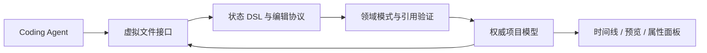
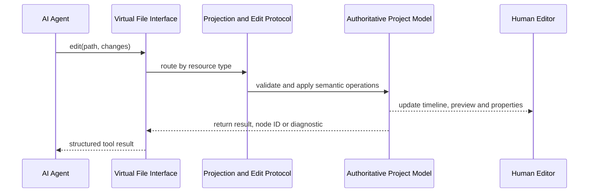
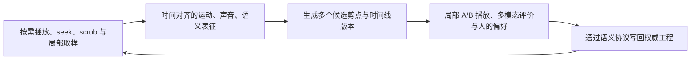

# Edit Video as Code：将视频工程映射为 Coding Agent 可读写的虚拟文件视图

> 面向视频、AI Agent 与创作工具工程师的中文技术文章
>
> 核心命题：不是让 AI 模拟人类点击剪辑软件，也不是让 AI 重写整个工程，而是把已经建模的视频运行态映射成一套 AI 可以像代码仓库一样发现、读取、定位、局部修改和验证的虚拟文件视图。

## 引言：AI Coding 真正依赖的不是“代码”两个字

今天的 AI 已经可以在一个大型代码仓库中完成相当复杂的工作。它会先查看目录，搜索符号，打开相关文件，只修改几行代码，再运行编译或测试，根据错误继续修正。

这件事经常被概括成“模型会写代码了”，但模型能力只是其中一半。另一半来自软件工程为 AI 提供了一套非常适合工作的环境：

- 项目有稳定的文件和目录；
- 文件可以按需读取，不必每次装入整个仓库；
- `glob` 和 `grep` 可以帮助模型定位目标；
- 修改可以用局部 patch 表达；
- 编译器、类型系统和测试可以拒绝错误；
- 仓库本身是一份持久的外部记忆；
- 人类可以查看 diff，随时接过来继续工作。

反过来看视频剪辑，很多 AI 系统给模型的工作环境仍然很原始。一种路线是让 AI 观察截图、寻找按钮、模拟点击和拖拽；另一种路线是给它几十甚至上百个细粒度工具，例如创建轨道、创建片段、设置素材、设置时长、设置位置、添加特效。还有一种做法是把整个时间线序列化成 JSON，让模型重新输出一份完整 JSON。

这些方案都能工作，但它们没有真正复用 AI Coding 已经证明有效的工作方式。

我们提出 **Edit Video as Code**：不要求视频工程本身变成代码，而是在视频运行态之上建立一套面向 AI 的虚拟文件视图，让 Coding Agent 可以像操作代码仓库一样操作视频项目。

它看到文件，使用文件工具，但修改的仍然是专业视频编辑器中的同一份权威工程。

## 一、首先要区分三件容易混淆的事

### 1. Edit Video as Code 不是用代码重新生成一个视频

FFmpeg 脚本、Remotion 页面或 Blender 脚本都可以生成视频，但它们通常建立了一套新的渲染程序。生成结果未必仍然是一个能被普通剪辑界面继续编辑的工程。

Edit Video as Code 的目标不同：

- AI 修改的是用户当前打开的项目；
- 修改后，时间线、预览和属性面板立即看到同一结果；
- 用户可以继续拖动、调整和撤销；
- AI 与人类不需要在两个工程之间导入、导出或同步。

### 2. 虚拟文件视图不是把数据库复制到临时目录

我们不会把协同状态、项目数据库和对象存储复制成一棵临时文件树，再建立一套双向同步逻辑。

虚拟文件视图是一层**实时投影**：

- `glob` 时，从当前项目、文档和素材资源计算文件列表；
- `read` 时，从当前权威模型生成对应的文件内容；
- `edit` 时，把文件式操作反向解析成领域操作；
- 写入仍落到原来的权威项目模型、素材资源或项目元数据。

文件视图本身不拥有第二份状态。

### 3. “像文件一样操作”不等于“把所有东西都当字符串”

代码仓库中的源文件通常以文本为权威状态，因此 Search/Replace 很自然。视频时间线不同：AI 看到的 VML 是运行态节点图的一种可读投影，不是系统内部保存的一整段 XML 字符串。

因此，文件是发现和读取边界，真正的写入仍然必须尊重节点身份、父子关系、顺序、引用和领域模式。

这也是为什么我们需要 DSL 和语义编辑协议，而不是只提供一个全局 Search/Replace。

## 二、AI 看到的视频项目是什么样的

一个 StarCut 项目可以被映射为：

```text
project.json

assets/
  product-shot.png
  product-demo.mp4
  narration.mp3
  logo.svg
  lower-third.mg

docs/
  brief.md
  script.md
  storyboard.md

compositions/
  main.vml
  intro.vml
```

这棵树专门面向 AI 的工作方式设计，而不是把内部数据库表逐项暴露出去。

### `project.json`：项目级信息

```json
{
  "name": "Product Launch",
  "nameMode": "custom",
  "description": "Thirty-second launch film",
  "coverUrl": "https://cdn.example.com/project-cover.webp",
  "coverMode": "custom"
}
```

它提供项目名称、描述和封面等项目级语义。该文件由系统管理，AI 可以读取，但不能把它当任意 JSON 根节点删除或覆盖。修改这些字段应使用专门的 `update_project`，因为它们具有系统级状态模式。

### `docs/*.md`：编辑过程中的文字资料

这里可以放 brief、脚本、分镜、旁白文本或持续更新的制作说明。

这些文档是 Agent 的持久工作材料，但不是另一份时间线模型。精确的 Clip 时间、轨道顺序和特效参数仍然只存在于 Composition 中。

### `assets/*`：项目资源

图片、视频、音频和文档是二进制素材资源（Artifact）；SVG 和 MG 则是可编辑文本资源。

AI 通过路径引用资源：

```text
assets/product-demo.mp4
```

路径负责可发现和可读，内部资源 ID 负责稳定身份，内容哈希负责版本和缓存。AI 不需要知道数据库记录、对象存储 key 或 CDN 存储细节。

### `compositions/*.vml`：视频时间线

Composition 使用 VML，也就是面向视频编辑领域的 XML-based DSL：

```xml
<Composition id="comp_main"
             width="1920"
             height="1080"
             fps="30"
             backgroundColor="#000000">
  <VideoTrack id="track_main" name="Main">
    <VideoClip id="clip_product"
               source="assets/product-demo.mp4"
               start="0"
               duration="5000000"
               sourceStart="0"
               sourceDuration="5000000" />
  </VideoTrack>

  <TextTrack id="track_title" name="Titles">
    <TextClip id="title_launch"
              start="500000"
              duration="2500000"><![CDATA[Product Launch]]></TextClip>
  </TextTrack>
</Composition>
```

AI 看到的是 Composition、Track、Clip 和 Effect，而不是协同存储容器、数据库字段、界面组件或解码器对象。

所有时间使用微秒，是为了避免浮点秒数在编辑、序列化和帧边界计算中产生不必要歧义。

## 三、虚拟文件视图的本质：稳定路径与稳定节点身份

一个视频项目需要两种地址。

### 文件路径负责发现

```text
compositions/main.vml
assets/product-demo.mp4
docs/script.md
```

路径让 AI 可以使用它已经熟悉的目录浏览、模式匹配和文件读取方式。

### 节点 ID 负责精确修改

```text
compositions/main.vml#clip_product
```

文件内部的 Track、Clip 和 Effect 使用系统生成的稳定 ID。一个 Clip 从第一条轨道移动到第二条轨道之后，它仍然是同一个 Clip，不应因为层级路径变化而失去身份。

因此我们没有让 AI 使用这种地址：

```text
/compositions/0/tracks/3/clips/12
```

数组下标是序列化布局，不是语义身份。一旦其他用户在前面插入一条轨道，整条路径的含义就会变化。

文件路径和节点 ID 的组合同时解决了两个问题：

- AI 可以先像浏览仓库一样发现文件；
- 找到目标以后，可以像使用符号引用一样精确操作节点。

## 四、权威状态不是文件树，而是具有稳定身份的节点图

虚拟视图之所以叫“映射”，是因为底层权威状态并不按照展示出来的 XML 文件树存储。抽象上，它是一张结构化节点图；每个节点保存：

```text
稳定 ID      节点在移动和重排后仍保持同一身份
领域类型     Composition、Track、Clip、Effect 等
领域属性     时间、素材引用、变换、样式等
父级归属     节点属于哪个父节点的哪个成员字段
相对顺序     节点在同一成员集合中的位置
```

子节点列表由父级归属和相对顺序计算，而不是把整棵嵌套数组作为一个整体反复覆盖。这种模型同时服务三个要求：

1. **运行态稳定身份**：移动节点不需要删除再创建；
2. **协同编辑**：一次局部修改只触及对应节点的属性、归属或顺序；
3. **统一领域验证**：父节点的领域模式决定可以接受哪些子节点和属性。

读取 VML 时，正向投影把节点图恢复为树形结构，将内部属性转换为公共 VML 属性，并把内部资源引用转换成 AI 可以理解的项目路径。写入时，反向投影把标签、属性、父节点和相对位置解析为领域操作，验证后修改同一份权威节点图。

在 StarCut 当前实现中，这张协同节点图由 Yjs 的 Y.Doc 承载，并使用扁平节点集合、原子父级归属和分数排序。它是运行时实现选择，不是 Edit Video as Code 要求 Agent 理解的接口。



图里的往返关系不表示复制数据。虚拟文件视图和人类编辑界面只是同一权威状态面向不同使用者的投影。

## 五、DSL 设计：让 AI 看到领域，而不是存储结构

### 1. 为什么使用 VML

视频时间线天然具有树形语义：Composition 包含 Track，Track 包含 Clip，部分 Clip 包含 Effect。XML 对这类结构有几个现实优势：

- 层级关系直接可见；
- 创建一个子树时不需要反复声明父子 ID；
- 属性形式紧凑；
- 文本和结构可以共存；
- 大模型对 XML/HTML 结构已经非常熟悉；
- 完整元素具有清晰的流式完成边界。

但 VML 不是为了映射任意 XML。每个标签、属性和父子关系都来自领域模式（schema）。

例如：

- `Composition` 可以包含 `VideoTrack`、`AudioTrack`、`TextTrack` 和 `EffectTrack`；
- `VideoTrack` 可以包含 `VideoClip`、`ImageClip` 和 `MotionGraphicClip`；
- `AudioTrack` 不能包含 `ImageClip`；
- `source` 必须引用项目中已经存在且类型兼容的 Artifact；
- 同一轨道中的 Clip 不能违反时间线规则；
- 未注册的 Effect tag 或属性会被拒绝。

DSL 提供的是一个公开、稳定、可验证的领域表面，而不是内部运行时对象的文本转储。

### 2. 读取时显示 ID，创建时不允许模型生成 ID

读取已有节点时必须显示 ID，因为 AI 需要精确定位：

```xml
<VideoClip id="clip_product" ... />
```

创建新节点时必须省略 ID：

```xml
<VideoClip source="assets/new-shot.mp4"
           start="5000000"
           duration="3000000" />
```

ID 由系统生成并在结果中返回。这样可以避免模型猜测、复用或制造重复 ID。

### 3. DSL 负责表达，领域模式负责判定

不能因为模型输出了看起来合理的 XML 就直接写入运行态。每个操作必须经过：

```text
公共 VML 语法
  -> 标签与属性解析
  -> 领域节点模式
  -> 父子关系验证
  -> 素材引用验证
  -> 权威项目模型修改
```

这相当于 AI Coding 中解析器、类型检查器与编译边界的组合。

### 4. 状态 DSL 与编辑协议是两层设计

这里需要明确区分两个经常被混在一起的概念：

- **VML 是状态 DSL**：它回答“这个视频工程现在是什么样”；
- **RESTful-like Edit Ops 是编辑协议**：它回答“要对现有状态做什么修改”。

创建节点时，编辑协议可以复用一段 VML 作为新子树的载荷，但这不意味着两者是同一种语言。前者负责可读的领域表示，后者负责可定位、可执行的状态变化。分开以后，读取格式可以保持完整和稳定，修改格式则可以保持局部和轻量。

## 六、为什么结构化时间线不能只用 Search/Replace

这是整个设计中最容易被误解的部分。

### 1. VML 是投影视图，不是文本真相源

假设 AI 读取到：

```xml
<VideoTrack id="track_main">
  <VideoClip id="clip_a" />
  <VideoClip id="clip_b" />
</VideoTrack>
```

底层并没有保存这段 XML。系统保存的是三个独立节点及其 `owner`、`order` 和属性。下一次读取时，序列化器重新生成 VML。

对这段投影字符串做 Search/Replace，只得到另一段字符串。系统仍然必须猜测这段字符串意味着：

- 修改某个属性；
- 移动一个已有节点；
- 删除一个节点；
- 创建一个新节点；
- 还是替换整份文档。

Search/Replace 本身没有表达这些语义。

这并不表示字符串替换在理论上无法实现结构编辑。系统可以解析替换前后的 VML、匹配节点身份、计算结构差异，再执行领域验证。但做到这一步，实际上已经重新实现了一层语义编辑器。让 Agent 直接表达目标节点和操作意图，边界会更清楚。

### 2. 重写文本会破坏稳定身份

如果把替换后的 VML 当成完整新文档重新导入，最直接的实现是保留根 ID、重建所有后代节点。

这会让一次“修改 opacity”变成：

```text
删除旧 Track / Clip / Effect
重新创建新 Track / Clip / Effect
重新建立引用和顺序
```

用户只改一个属性，系统却失去了大量节点身份。Undo、协同和其他运行态索引都会承担无关变化。

### 3. Search/Replace 不理解 move

把一个 Clip 从 Track A 移到 Track B，本质上是修改它的 `owner` 和 `order`，身份保持不变。

在字符串层面，它看起来像从一处删除 XML、在另一处插入 XML。除非额外建立结构 diff 和身份匹配，否则系统无法知道它是同一个节点的移动。

### 4. Search/Replace 的匹配对象不稳定

虚拟 VML 可能因为规范化格式、属性顺序、引用路径投影或其他协同修改而变化。模型必须先持有一段完全一致的旧字符串，替换才可能成功。

这对于真正的文本源是合理的乐观并发条件，但对于结构化运行态，它把语义修改错误地绑定到了序列化格式。

### 5. 它扩大了并发冲突范围

另一个用户可能刚刚修改了同一文件中完全无关的 Track。全文 Search/Replace 或完整覆盖需要在更大的文本范围上进行匹配或重建；语义节点编辑只触及目标 ID 的属性或归属。

底层 CRDT 仍然负责真正的合并。我们的优势不是“有 Search/Replace 就不能协同”，而是局部语义操作拥有更小、更准确的写集合。

### 6. 但 Search/Replace 并不是被全面禁止

对于真正以文本为权威状态的文件，精确 Search/Replace 是合理的：

- `docs/*.md`；
- `assets/*.svg`；
- `assets/*.mg`。

TextClip 和 CaptionClip 的 Text Data 也可以在明确的 Node ID 之内执行精确 Search/Replace：

```text
PATCH #title_launch
<<<<<<< SEARCH
Product Launch
=======
Summer Launch
>>>>>>> REPLACE
```

这里被替换的是一个节点明确拥有的文本属性，不是整棵时间线的投影字符串。

正确边界是：

> 文本源使用文本编辑；结构化投影使用语义结构编辑；结构节点内部的文本属性可以在节点边界内使用精确文本编辑。

## 七、RESTful-like Ops：像修改资源一样修改视频节点

为了让 AI 能够局部编辑 VML，我们使用四类短操作。`RESTful-like` 描述的是“以资源为中心、用短动词表达意图”的设计直觉，并不声称这套协议符合 HTTP REST，也不表示它是 JSON Patch 的变体。

### PATCH：修改属性或节点文本

```text
PATCH #clip_product
start="1000000"
duration="4000000"
opacity="0.8"
```

目标是稳定节点 ID，属性行提供清楚的增量解析边界。

### POST：在目标父节点下创建子树

```text
POST #track_main
before: #clip_outro
<VideoClip source="assets/product-demo.mp4"
           start="5000000"
           duration="3000000"
           sourceStart="0"
           sourceDuration="3000000" />
```

POST 载荷直接复用 VML。模型一次就能表达节点类型、属性和嵌套子树，不需要连续调用 `create_clip`、`set_source`、`set_start` 和 `set_duration`。

### PUT：移动或重排已有节点

```text
PUT #clip_product
to: #track_broll
before: #clip_outro
```

PUT 保留节点身份，只改变它的语义位置。

### DELETE：删除节点

```text
DELETE #effect_vignette
```

删除仍需经过引用、必需结构和父节点领域模式验证。

### 为什么没有长路径

操作目标写成：

```text
#clip_product
```

而不是：

```text
/compositions/main/tracks/1/clips/4
```

短 ID 更适合模型输出，也不会因为前面的 sibling 插入或重排而变化。文件路径负责限定文档，节点 ID 负责限定资源。

## 八、为什么这套协议适合模型流式输出

大模型从左到右生成 token。如果一种编辑格式只有在整个深层对象闭合后才具备意义，编辑器就只能等工具参数全部生成完再开始工作。

RESTful-like Ops 的优势，是语法中存在连续、可识别的语义完成边界：

- 完整的 `PATCH #id` 行确定目标；
- 完整的属性行确定一次属性写；
- 完整的 `DELETE #id` 操作确定删除；
- 完整的 `PUT` 操作确定移动；
- `POST` 中一个完整节点或子树闭合后，创建语义成立。

工具的外层仍然是标准结构：

```json
{
  "path": "compositions/main.vml",
  "changes": "PATCH #clip_product\nopacity=\"0.8\""
}
```

外层参数先给出文件路径，系统随后对 `changes` 的连续输入前缀做渐进解析。只有已经形成完整语义的操作才会执行；如果实时传输出现缺口，解析器会停止消费后续片段，避免在缺失上下文的情况下继续写入。

最终完整输入到达时，它承担的是**补齐缺失后缀并闭合解析器**的作用，而不是从头重放整次调用。已经执行的连续前缀不会重复执行。

于是低延迟执行和最终输入闭合共享同一条写路径：

```text
连续且语义完整的前缀 ─> 渐进解析与执行
最终完整输入         ─> 补齐缺失后缀并完成解析
```

这里必须避免一个过度承诺：**最终完整输入不是数据库意义上的原子提交点。** 前面的合法操作可能已经进入项目；后面的操作如果验证失败，不应被描述为自动回滚整次编辑。编辑器可以把一次 Agent 调用组织成一个便于撤销的用户动作，但传输取消、解析失败和事务回滚仍然是三个不同概念。

## 九、AI 使用的基本工具

Edit Video as Code 刻意把基础入口收敛到 Coding Agent 熟悉的几类，但“工具名像文件工具”不意味着底层按普通磁盘文件执行。

| 工具 | 作用 | 关键边界 |
|---|---|---|
| `glob` | 按模式发现 Composition、文档和素材路径 | 返回真实存在的项目资源，Agent 不应猜路径 |
| `grep` | 查找文本、标签、属性和素材引用 | 结构化结果同时返回文件路径与节点 ID |
| `read` | 读取文件或 `path#id` 指向的 VML 子树 | 局部任务不必读取整条时间线 |
| `head` | 读取素材类型、时长、尺寸、哈希和状态 | 语义接近 HTTP `HEAD`，不是读取文本文件的前几行 |
| `write` | 从零创建完整 Composition 或文本资源 | 已有 VML 的完整覆盖会扩大写入范围，不是局部编辑的默认方式 |
| `edit` | 修改已有文件 | VML 使用语义操作，真实文本源使用精确文本替换 |

例如，Agent 可以读取完整 Composition，也可以只读取一个节点子树：

```text
read("compositions/main.vml")
read("compositions/main.vml#clip_product")
head("assets/product-demo.mp4")
```

`edit` 是统一的文件式入口，但不同文件类型拥有不同写入语义：

- VML 使用 `PATCH`、`POST`、`PUT`、`DELETE`；
- Markdown、SVG、MG 使用精确 Search/Replace；
- TextClip 和 CaptionClip 可以在明确的节点边界内修改文本数据。

当前实现也有明确边界：SVG 和 MG 源文件在已知路径后可以读取，但尚未被描述为拥有完整的全项目全文索引。

`update_project` 则不是通用文件工具，而是系统管理资源的专用写入口：

```json
{
  "name": "Summer Launch",
  "description": "Thirty-second launch film"
}
```

它没有被强行塞进 VML 或全文 JSON 替换，因为项目元数据拥有不同的系统约束。这里追求的不是“所有东西必须共用一个工具”，而是让同类编辑收敛到稳定接口，同时保留必要的领域边界。

## 十、一次完整的 AI 剪辑过程

假设用户要求：

> 找到产品演示镜头，把它缩短到三秒，并在后面增加一张产品海报。

Agent 可以这样工作。

### 第一步：发现素材和时间线

```text
glob("compositions/**/*.vml")
glob("assets/*.{mp4,png,jpg,jpeg,webp}")
```

### 第二步：读取素材元数据

```text
head("assets/product-demo.mp4")
head("assets/product-shot.png")
```

AI 确认视频源时长和图片尺寸，而不是从文件名猜测。

### 第三步：定位素材引用

```text
grep(
  pattern="assets/product-demo.mp4",
  path="compositions/**/*.vml"
)
```

结果返回：

```text
compositions/main.vml#clip_product
```

### 第四步：只读取目标附近结构

```text
read("compositions/main.vml#track_main")
```

AI 获取目标 Clip 的实际时间和它后面的 sibling ID。

### 第五步：一个逻辑编辑调用完成修改

```text
PATCH #clip_product
duration="3000000"
sourceDuration="3000000"

POST #track_main
before: #clip_outro
<ImageClip source="assets/product-shot.png"
           start="3000000"
           duration="2000000" />
```

解析器按顺序执行操作。每次写入都经过 Track/Clip 领域模式和素材引用验证，最终结果进入同一份权威项目模型，也立即反映到人类时间线界面。

### 第六步：按需要验证

如果后续操作需要新建 ImageClip 的 ID，工具结果会返回创建 ID；如果任务已由确定性结构验证完整判定，就没有必要为了仪式感再次读取整个文件。涉及构图或审美时，再打开预览或抽取画面进行视觉验证。

这与成熟 Coding Agent 的行为一致：先定位、再读取必要上下文、局部修改、使用适合任务的验证，而不是每次遍历整个项目。

## 十一、架构上如何保证 AI 和人类编辑的是同一个项目

虚拟文件视图不能形成新的业务状态。完整写链路如下：



这里有几个关键点。

### 1. Agent 工具不直接维护项目副本

`glob`、`grep`、`read` 和 `head` 都从当前权威状态生成结果；`edit` 和 `write` 通过当前项目的编辑入口写回。工具层不缓存一份等待事后合并的“AI 工程”。

### 2. 文件类型共享入口，但不共享错误的写入语义

```text
.vml        -> 结构化节点操作
.md         -> 文本编辑
.svg / .mg  -> 可编辑素材源
```

同名 `edit` 工具只统一 Agent 的交互入口，具体执行语义仍由资源类型决定。

### 3. VML 的正向和反向投影由同一领域模式驱动

读路径把领域节点转换为公共 VML；写路径把 VML 编辑操作转换回领域节点修改。标签、属性、引用和子节点位置不应在解析、验证与界面层各自维护一份定义。

### 4. 协同模型仍然是权威状态

AI 修改进入权威模型后，人类界面沿原有的状态观察与视图投影链路更新。AI 不需要发送额外的“请刷新界面”消息，界面也不需要在 Agent 完成后重读一份旁路 JSON。

### 5. 大型媒体与结构状态各自保持合理的权威边界

大二进制媒体和可编辑图形内容由素材资源系统管理；Composition 只保存稳定引用。虚拟文件视图把两者组织到同一项目空间，但不会为了目录形式而把媒体内容硬塞进协同节点图。

这让协同结构状态与媒体存储各自在合理层级保持权威，又能为 AI 呈现一棵统一项目树。

## 十二、为什么不把每个剪辑动作都做成一个工具

如果每个领域动作都是顶层工具，加入一种新 Clip 或 Effect 时，通常还要增加新的创建、修改、查询工具和参数描述。

工具数量会随领域能力一起增长：

```text
create_video_clip
create_image_clip
create_motion_graphic_clip
set_clip_timing
set_clip_transform
set_clip_opacity
move_clip
add_vignette_effect
...
```

这条路线并非错误。专用工具具有明确的参数模式，适合生成、转写、播放控制和外部服务等边界清楚的能力。

但对于已经进入项目模型的结构编辑，更收敛的方式是：

- 顶层工具保持为文件发现、读取和编辑；
- 新的节点类型和属性由 DSL 的领域模式扩展；
- `edit` 的公共操作保持稳定；
- AI 通过技能或领域规范学习新 tag 和 attribute。

这样，系统扩展的是领域语言，而不是不断膨胀顶层工具面。

## 十三、Edit Video as Code 的真正价值

### 1. 给 AI 一份可工作的外部记忆

项目不再需要被完整复制进每一轮 Prompt。AI 可以随时重新发现和读取当前状态。

### 2. 让读取成本与任务相关，而不是与工程总量相关

一个局部任务可以只读取一个文件、一个 Track 或一个 Clip 子树。

### 3. 让修改范围与用户意图一致

修改一个属性只触及一个节点属性；移动一个 Clip 只改变它的归属和顺序；创建一个子树不会要求重写完整 Composition。

### 4. 让 AI 复用 Coding Agent 已经形成的能力

文件树、glob、grep、read、patch、领域校验错误和验证闭环，都是模型已经高度熟悉的交互结构。

[SWE-agent](https://arxiv.org/abs/2405.15793) 的研究已经表明，Agent-Computer Interface 的设计会显著影响模型完成软件工程任务的能力。Edit Video as Code 把同一问题带到具有连续时间、媒体引用、视觉验收和协同状态的视频编辑领域。

### 5. 让人类始终可以接管

AI 没有产出一个封闭的最终视频，而是在专业编辑工程中留下可见、可撤销、可继续修改的结构变化。

## 十四、AI Cut 与 Human Cut：接口解决“怎么改”，还没有解决“为什么这样剪”

这里必须正视这套方法的能力边界：**可编辑不等于会剪辑。**

Edit Video as Code 让 AI 能够准确找到一个 Clip，把入点移动 12 帧，或者把一组镜头按计划排到时间线上。它解决的是动作接口和工程状态问题。但“为什么应该在这一帧切”“这个镜头再多留半秒是否更有力量”，并不会因为操作变得精确而自然得到答案。

当前 AI Cut 与有经验的 Human Cut，主要差在对连续时间的观察和判断方式：

| 维度 | 当前 AI Cut 更擅长的方式 | Human Cut 的典型判断 |
|---|---|---|
| 工程理解 | 读取时间码、字幕、标签、素材元数据和结构关系 | 同时理解工程结构、画面内容与创作意图 |
| 剪点选择 | 根据语义边界、规则、镜头检测结果或离散采样帧选点 | 感知动作的预备、发生与收势，在连续运动相位中选点 |
| 节奏控制 | 依据时长、语速、节拍点和模板调整 | 判断停顿、呼吸、期待、释放以及段落之间的能量变化 |
| 连贯性 | 检查素材引用、时间关系和显式约束 | 同时判断视线、构图、运动方向、声音和有意或无意的跳跃 |
| 结果评价 | 判断是否完成指令、结构是否合法 | 判断一个合法版本是否自然、准确、有力，是否服务整段叙事 |
| 迭代方式 | 修改结构后读取状态，按需查看少量画面 | 反复播放、拖动、逐帧比较，在上下文中微调几个帧 |

这里所说的“感受”不是不可研究的直觉。人类剪辑师是在高带宽地综合连续画面和声音：主体速度与加速度、镜头运动、姿态和视线变化、语音重音与停顿、音乐节拍与瞬态，以及前后镜头建立的预期。经验把这些信号压缩成了快速判断，所以剪辑师常常先“觉得不对”，再把原因解释出来。

已有研究也说明，剪点并非完全没有统计规律。[Learning Where to Cut from Edited Videos](https://openaccess.thecvf.com/content/ICCV2021W/CVEU/html/Huang_Learning_Where_To_Cut_From_Edited_Videos_ICCVW_2021_paper.html) 通过用户研究验证了人们对部分好坏剪点存在共识，并学习未剪素材中的合适剪切区域；[Learning to Cut by Watching Movies](https://openaccess.thecvf.com/content/ICCV2021/html/Pardo_Learning_To_Cut_by_Watching_Movies_ICCV_2021_paper.html) 则从专业成片中学习跨镜头的视听模式，对剪点合理性进行排序。[VEU-Bench](https://openaccess.thecvf.com/content/CVPR2025/html/Li_VEU-Bench_Towards_Comprehensive_Understanding_of_Video_Editing_CVPR_2025_paper.html) 进一步把视频编辑理解拆成识别、推理和判断任务，并显示当前视频语言模型在这些任务上仍面临明显困难。这些工作表明“剪在哪里”可以学习，但也揭示了它不同于结构合法性检查：它需要连续视听证据、候选比较和人的偏好评价。

因此，这篇文章不能把结构编辑协议的价值夸大成完整的剪辑智能。更准确的分层是：

1. **工程接口**解决状态如何被发现、寻址和修改；
2. **感知接口**解决 Agent 如何按需观看、聆听和比较连续时间片段；
3. **剪辑判断**解决多个合法方案中，哪一个更符合运动、节奏、情绪和叙事目标。

Edit Video as Code 主要完成第一层，并为后两层提供可执行的工程基础。下一步突破，不是继续增加更多 `set_xxx` 工具，而是建立感知—编辑—评价闭环：



这个闭环至少需要四类能力。

第一，Agent 需要**主动观察**，而不是一次性吞下整条视频。它应当能围绕候选剪点快速播放前后窗口、逐帧拖动、比较两个版本，并在发现问题后扩大观察范围。浏览器端的播放、seek、scrub 调度和缩略图获取因此不只是性能优化，也是在建设 AI 的时间感知接口；这与[班车式解码和 GOP Flight 调度](./01-gop-shuttle.md)是同一条技术路线的上下两层。

第二，系统需要**时间对齐的感知表征**。镜头边界、光流、主体轨迹、相机运动、姿态、视线、显著区域、语音韵律、音乐节拍和声音事件，都可以成为观察证据。但这些特征不能被简单堆成一份巨大的 Prompt；它们应当按任务、时间窗口和不确定性被检索。

第三，评价方式需要从“是否完成指令”推进到**候选排序与偏好判断**。一个剪点很少只有合法或非法两种状态。系统应生成附近多个候选，播放局部结果，再根据连贯性、动作相位、节奏和用户意图排序。视觉语言模型或专用剪辑评价器可以提供意见，但不应被包装成绝对审美分数。

第四，需要学习真正的**编辑过程数据**。只有最终成片，通常看不到剪辑师舍弃了哪些素材、在哪些位置来回 scrub、比较过哪些版本，以及为什么把剪点向前或向后移动几帧。若能在获得授权和保护隐私的前提下记录“源素材—候选操作—局部预览—最终选择—后续修正”，就能把人的判断过程变成更有价值的训练与评测信号。

所以 AI Cut 的下一步，不只是“把时间线排得更完整”，而是让 Agent 获得一种可选择地观看连续时间、形成候选、感受差异并用结果修正自己的能力。DSL 和编辑协议提供手，播放与 scrub 调度提供眼睛和耳朵，剪辑评价与人类反馈才逐步形成判断。

## 结语：不是把视频变成代码，而是给 AI 一套像代码一样可工作的界面

视频工程不会因为 AI 的出现就变成一堆普通文本。它仍然包含连续时间、媒体引用、渲染状态、协同关系和专业领域约束。

但 AI 不应该被迫通过像素坐标理解这一切，也不应该每次重新输出完整工程。

Edit Video as Code 的关键，是在专业运行态和 Coding Agent 之间建立一层准确的映射：

```text
视频运行态
  -> 虚拟项目文件
  -> 文件式发现和读取
  -> DSL 语义表达
  -> 局部结构操作
  -> 领域模式验证
  -> 回到同一视频运行态
```

AI 看到的是文件，但文件不是另一份数据；AI 输出的是文本，但执行的不是盲目字符串替换；AI 使用的是 Coding 工作流，但修改的仍然是真实、可继续编辑的视频工程。

当项目可发现、状态可寻址、修改可局部化、错误可验证、人类可接管时，AI 才不只是“会调用几个剪辑工具”，而是获得了像 Coding 一样持续操作视频工程的工作界面。这解决了剪辑智能的手和工程记忆；眼睛、耳朵与判断力，还需要连续时间感知和评价闭环继续补上。

## 相关资料

1. J. Yang et al., [SWE-agent: Agent-Computer Interfaces Enable Automated Software Engineering](https://arxiv.org/abs/2405.15793), 2024.
2. B. Wang et al., [LAVE: LLM-Powered Agent Assistance and Language Augmentation for Video Editing](https://arxiv.org/abs/2402.10294), IUI 2024.
3. Z. Cao et al., [AgenticVBench: Can AI Agents Complete Real-World Post-Production Tasks?](https://arxiv.org/abs/2605.27705), 2026.
4. P. Bryan and M. Nottingham, [RFC 6902: JSON Patch](https://www.rfc-editor.org/rfc/rfc6902), 2013. RFC 6902 是面向通用 JSON 文档的路径式补丁标准。这里列出它是为了界定结构化编辑的问题空间；本文协议以稳定领域节点为目标，语法与执行模型均不同。
5. Y. Huang et al., [Learning Where to Cut from Edited Videos](https://openaccess.thecvf.com/content/ICCV2021W/CVEU/html/Huang_Learning_Where_To_Cut_From_Edited_Videos_ICCVW_2021_paper.html), ICCV Workshops 2021.
6. A. Pardo et al., [Learning to Cut by Watching Movies](https://openaccess.thecvf.com/content/ICCV2021/html/Pardo_Learning_To_Cut_by_Watching_Movies_ICCV_2021_paper.html), ICCV 2021.
7. B. Li et al., [VEU-Bench: Towards Comprehensive Understanding of Video Editing](https://openaccess.thecvf.com/content/CVPR2025/html/Li_VEU-Bench_Towards_Comprehensive_Understanding_of_Video_Editing_CVPR_2025_paper.html), CVPR 2025.
