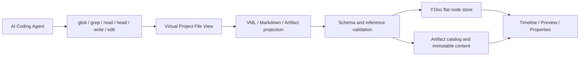
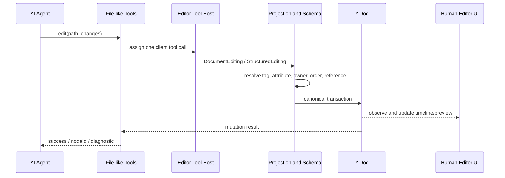

# Edit Video as Code：将视频工程映射为 Coding Agent 可读写的虚拟文件视图

> 面向技术同学的中文技术文章完整稿
>
> 核心命题：不是让 AI 模拟人类点击剪辑软件，也不是让 AI 重写整个工程，而是把已经建模的视频运行态映射成一套 AI 可以像代码仓库一样发现、读取、定位、局部修改和验证的虚拟文件视图。

## 引言：AI Coding 真正依赖的不是“代码”两个字

今天的 AI 已经可以在一个大型代码仓库中完成相当复杂的工作。它会先查看目录，搜索符号，打开相关文件，只修改几行代码，再运行编译或测试，根据错误继续修正。

这件事经常被概括成“模型会写代码了”，但模型能力只是其中一半。另一半来自软件工程为 AI 提供了一套非常适合工作的环境：

- 项目有稳定的文件和目录；
- 文件可以按需读取，不必每次装入整个仓库；
- `glob` 和 `grep` 可以帮助模型定位目标；
- 修改可以用局部 patch 表达；
- 编译器、类型系统和测试可以拒绝错误；
- 仓库本身是一份持久的外部记忆；
- 人类可以查看 diff，随时接过来继续工作。

反过来看视频剪辑，很多 AI 系统给模型的工作环境仍然很原始。一种路线是让 AI 观察截图、寻找按钮、模拟点击和拖拽；另一种路线是给它几十甚至上百个细粒度工具，例如创建轨道、创建片段、设置素材、设置时长、设置位置、添加特效。还有一种做法是把整个时间线序列化成 JSON，让模型重新输出一份完整 JSON。

这些方案都能工作，但它们没有真正复用 AI Coding 已经证明有效的工作方式。

我们提出 **Edit Video as Code**：不要求视频工程本身变成代码，而是在视频运行态之上建立一套面向 AI 的虚拟文件视图，让 Coding Agent 可以像操作代码仓库一样操作视频项目。

它看到文件，使用文件工具，但修改的仍然是专业视频编辑器中的同一份权威工程。

## 一、首先要区分三件容易混淆的事

### 1. Edit Video as Code 不是用代码重新生成一个视频

FFmpeg 脚本、Remotion 页面或 Blender 脚本都可以生成视频，但它们通常建立了一套新的渲染程序。生成结果未必仍然是一个能被普通剪辑界面继续编辑的工程。

Edit Video as Code 的目标不同：

- AI 修改的是用户当前打开的项目；
- 修改后，时间线、预览和属性面板立即看到同一结果；
- 用户可以继续拖动、调整和撤销；
- AI 与人类不需要在两个工程之间导入、导出或同步。

### 2. 虚拟文件视图不是把数据库复制到临时目录

我们不会把 Y.Doc、数据库和对象存储复制成一棵临时文件树，再建立一套双向同步逻辑。

虚拟文件视图是一层**实时投影**：

- `glob` 时，从当前 Project、Document 和 Artifact 状态计算文件列表；
- `read` 时，从当前权威模型生成对应的文件内容；
- `edit` 时，把文件式操作反向解析成领域操作；
- 写入仍落到原来的 Y.Doc、Artifact 或项目元数据模型。

文件视图本身不拥有第二份状态。

### 3. “像文件一样操作”不等于“把所有东西都当字符串”

代码仓库中的源文件通常以文本为权威状态，因此 Search/Replace 很自然。视频时间线不同：AI 看到的 VML 是运行态节点图的一种可读投影，不是系统内部保存的一整段 XML 字符串。

因此，文件是发现和读取边界，真正的写入仍然必须尊重节点身份、父子关系、顺序、引用和领域模式。

这也是为什么我们需要 DSL 和语义编辑协议，而不是只提供一个全局 Search/Replace。

## 二、AI 看到的视频项目是什么样的

一个 StarCut 项目可以被映射为：

```text
project.json

assets/
  product-shot.png
  product-demo.mp4
  narration.mp3
  logo.svg
  lower-third.mg

docs/
  brief.md
  script.md
  storyboard.md

compositions/
  main.vml
  intro.vml
```

这棵树专门面向 AI 的工作方式设计，而不是把内部数据库表逐项暴露出去。

### `project.json`：项目级信息

```json
{
  "name": "Product Launch",
  "nameMode": "custom",
  "description": "Thirty-second launch film",
  "coverUrl": "https://cdn.example.com/project-cover.webp",
  "coverMode": "custom"
}
```

它提供项目名称、描述和封面等项目级语义。该文件由系统管理，AI 可以读取，但不能把它当任意 JSON 根节点删除或覆盖。修改这些字段应使用专门的 `update_project`，因为它们具有系统级状态模式。

### `docs/*.md`：编辑过程中的文字资料

这里可以放 brief、脚本、分镜、旁白文本或持续更新的制作说明。

这些文档是 Agent 的持久工作材料，但不是另一份时间线模型。精确的 Clip 时间、轨道顺序和特效参数仍然只存在于 Composition 中。

### `assets/*`：项目资源

图片、视频、音频和文档是二进制 Artifact；SVG 和 MG 则是可编辑文本 Artifact。

AI 通过路径引用资源：

```text
assets/product-demo.mp4
```

路径负责可发现和可读，内部 Artifact ID 负责稳定身份，内容哈希负责版本和缓存。AI 不需要知道数据库记录、OSS key 或 CDN 存储细节。

### `compositions/*.vml`：视频时间线

Composition 使用 VML，也就是面向视频编辑领域的 XML-based DSL：

```xml
<Composition id="comp_main"
             width="1920"
             height="1080"
             fps="30"
             backgroundColor="#000000">
  <VideoTrack id="track_main" name="Main">
    <VideoClip id="clip_product"
               source="assets/product-demo.mp4"
               start="0"
               duration="5000000"
               sourceStart="0"
               sourceDuration="5000000" />
  </VideoTrack>

  <TextTrack id="track_title" name="Titles">
    <TextClip id="title_launch"
              start="500000"
              duration="2500000"><![CDATA[Product Launch]]></TextClip>
  </TextTrack>
</Composition>
```

AI 看到的是 Composition、Track、Clip 和 Effect，而不是 Y.Map、数据库字段、React component 或解码器对象。

所有时间使用微秒，是为了避免浮点秒数在编辑、序列化和帧边界计算中产生不必要歧义。

## 三、虚拟文件视图的本质：稳定路径与稳定节点身份

一个视频项目需要两种地址。

### 文件路径负责发现

```text
compositions/main.vml
assets/product-demo.mp4
docs/script.md
```

路径让 AI 可以使用它已经熟悉的目录浏览、模式匹配和文件读取方式。

### 节点 ID 负责精确修改

```text
compositions/main.vml#clip_product
```

文件内部的 Track、Clip 和 Effect 使用系统生成的稳定 ID。一个 Clip 从第一条轨道移动到第二条轨道之后，它仍然是同一个 Clip，不应因为层级路径变化而失去身份。

因此我们没有让 AI 使用这种地址：

```text
/compositions/0/tracks/3/clips/12
```

数组下标是序列化布局，不是语义身份。一旦其他用户在前面插入一条轨道，整条路径的含义就会变化。

文件路径和节点 ID 的组合同时解决了两个问题：

- AI 可以先像浏览仓库一样发现文件；
- 找到目标以后，可以像使用符号引用一样精确操作节点。

## 四、底层不是文件树，而是适合运行态和协同的节点模型

虚拟视图之所以叫“映射”，是因为底层数据并不按照展示出来的 XML 嵌套存储。

当前项目的结构化状态保存在一张扁平的 `Y.Map("nodes")` 中。每个节点具有：

```text
id          稳定身份
nodeType    领域类型
properties  领域属性
owner       { id, prop }，原子化父级归属
order       同一 Members 字段内的 fractional order
```

Children 列表由 `owner` 和 `order` 计算，而不是在父节点里保存一份可冲突的嵌套数组。

这种模型主要服务三个要求：

1. **运行态稳定身份**：移动节点不需要删除再创建；
2. **协同编辑**：父级归属是一个原子值，排序使用 fractional indexing；
3. **统一领域验证**：父节点 schema 决定可以接受哪些子节点和属性。

读取 VML 时，Document projection 沿 `owner` 关系恢复树形结构，把内部属性转换为公共 VML 属性，并把内部 Artifact ID 转换成 AI 可以理解的项目路径。

写入 VML 时，系统执行反向投影：公共 tag、attribute、父节点和 sibling 被解析为 canonical Node 操作，再写入同一张 Y.Doc 节点表。



图里的箭头不是一条数据复制流水线。Virtual View、Timeline UI 和 Preview 都是同一权威状态的不同投影。

## 五、DSL 设计：让 AI 看到领域，而不是存储结构

### 1. 为什么使用 VML

视频时间线天然具有树形语义：Composition 包含 Track，Track 包含 Clip，部分 Clip 包含 Effect。XML 对这类结构有几个现实优势：

- 层级关系直接可见；
- 创建一个子树时不需要反复声明父子 ID；
- 属性形式紧凑；
- 文本和结构可以共存；
- 大模型对 XML/HTML 结构已经非常熟悉；
- 完整元素具有清晰的流式完成边界。

但 VML 不是为了映射任意 XML。每个 tag、attribute 和父子关系都来自领域 schema。

例如：

- `Composition` 可以包含 `VideoTrack`、`AudioTrack`、`TextTrack` 和 `EffectTrack`；
- `VideoTrack` 可以包含 `VideoClip`、`ImageClip` 和 `MotionGraphicClip`；
- `AudioTrack` 不能包含 `ImageClip`；
- `source` 必须引用项目中已经存在且类型兼容的 Artifact；
- 同一轨道中的 Clip 不能违反时间线规则；
- 未注册的 Effect tag 或属性会被拒绝。

DSL 提供的是一个公开、稳定、可验证的领域表面，而不是内部 TypeScript object 的文本 dump。

### 2. 读取时显示 ID，创建时不允许模型生成 ID

读取已有节点时必须显示 ID，因为 AI 需要精确定位：

```xml
<VideoClip id="clip_product" ... />
```

创建新节点时必须省略 ID：

```xml
<VideoClip source="assets/new-shot.mp4"
           start="5000000"
           duration="3000000" />
```

ID 由系统生成并在结果中返回。这样可以避免模型猜测、复用或制造重复 ID。

### 3. DSL 负责表达，schema 负责判定

不能因为模型输出了看起来合理的 XML 就直接写入运行态。每个操作必须经过：

```text
public VML syntax
  -> public tag/attribute resolution
  -> canonical node schema
  -> parent/child validation
  -> reference validation
  -> Y.Doc mutation
```

这相当于 AI Coding 中的 parser、type checker 和 compiler boundary。

## 六、为什么结构化时间线不能只用 Search/Replace

这是整个设计中最容易被误解的部分。

### 1. VML 是投影视图，不是文本真相源

假设 AI 读取到：

```xml
<VideoTrack id="track_main">
  <VideoClip id="clip_a" />
  <VideoClip id="clip_b" />
</VideoTrack>
```

底层并没有保存这段 XML。系统保存的是三个独立节点及其 `owner`、`order` 和属性。下一次读取时，序列化器重新生成 VML。

对这段投影字符串做 Search/Replace，只得到另一段字符串。系统仍然必须猜测这段字符串意味着：

- 修改某个属性；
- 移动一个已有节点；
- 删除一个节点；
- 创建一个新节点；
- 还是替换整份文档。

Search/Replace 没有表达这些语义。

### 2. 重写文本会破坏稳定身份

如果把替换后的 VML 当成完整新文档重新导入，最简单的实现是保留根 ID、重建所有 descendants。

这会让一次“修改 opacity”变成：

```text
删除旧 Track / Clip / Effect
重新创建新 Track / Clip / Effect
重新建立引用和顺序
```

用户只改一个属性，系统却失去了大量节点身份。Undo、协同和其他运行态索引都会承担无关变化。

### 3. Search/Replace 不理解 move

把一个 Clip 从 Track A 移到 Track B，本质上是修改它的 `owner` 和 `order`，身份保持不变。

在字符串层面，它看起来像从一处删除 XML、在另一处插入 XML。除非额外建立结构 diff 和身份匹配，否则系统无法知道它是同一个节点的移动。

### 4. Search/Replace 的匹配对象不稳定

虚拟 VML 可能因为 canonical formatting、属性顺序、引用路径投影或其他协同修改而变化。模型必须先持有一段完全一致的旧字符串，替换才可能成功。

这对于真正的文本源是合理的乐观并发条件，但对于结构化运行态，它把语义修改错误地绑定到了序列化格式。

### 5. 它扩大了并发冲突范围

另一个用户可能刚刚修改了同一文件中完全无关的 Track。全文 Search/Replace 或完整覆盖需要在更大的文本范围上进行匹配或重建；语义节点编辑只触及目标 ID 的属性或归属。

底层 CRDT 仍然负责真正的合并。我们的优势不是“有 Search/Replace 就不能协同”，而是局部语义操作拥有更小、更准确的写集合。

### 6. 但 Search/Replace 并不是被全面禁止

对于真正以文本为权威状态的文件，精确 Search/Replace 是合理的：

- `docs/*.md`；
- `assets/*.svg`；
- `assets/*.mg`。

TextClip 和 CaptionClip 的 Text Data 也可以在明确的 Node ID 之内执行精确 Search/Replace：

```text
PATCH #title_launch
<<<<<<< SEARCH
Product Launch
=======
Summer Launch
>>>>>>> REPLACE
```

这里被替换的是一个节点明确拥有的文本属性，不是整棵时间线的投影字符串。

正确边界是：

> 文本源使用文本编辑；结构化投影使用语义结构编辑；结构节点内部的文本属性可以在节点边界内使用精确文本编辑。

## 七、RESTful-like Ops：像修改资源一样修改视频节点

为了让 AI 能够局部编辑 VML，我们使用四类短操作。它们借用了 REST 的资源操作直觉，但不是 HTTP REST，也不是 JSON Patch。

### PATCH：修改属性或节点文本

```text
PATCH #clip_product
start="1000000"
duration="4000000"
opacity="0.8"
```

目标是稳定节点 ID，每个属性行都能独立解析和验证。

### POST：在目标父节点下创建子树

```text
POST #track_main
before: #clip_outro
<VideoClip source="assets/product-demo.mp4"
           start="5000000"
           duration="3000000"
           sourceStart="0"
           sourceDuration="3000000" />
```

POST 载荷直接复用 VML。模型一次就能表达节点类型、属性和嵌套子树，不需要连续调用 `create_clip`、`set_source`、`set_start` 和 `set_duration`。

### PUT：移动或重排已有节点

```text
PUT #clip_product
to: #track_broll
before: #clip_outro
```

PUT 保留节点身份，只改变它的语义位置。

### DELETE：删除节点

```text
DELETE #effect_vignette
```

删除仍需经过引用、必需结构和父节点模式验证。

### 为什么没有长路径

操作目标写成：

```text
#clip_product
```

而不是：

```text
/compositions/main/tracks/1/clips/4
```

短 ID 更适合模型输出，也不会因为前面的 sibling 插入或重排而变化。文件路径负责限定文档，节点 ID 负责限定资源。

## 八、为什么这套协议适合模型流式输出

大模型从左到右生成 token。如果必须等待一个深层 JSON 对象全部闭合，编辑器只能在工具参数完整以后开始工作。

RESTful-like Ops 的局部完成边界更清楚：

- 完整的 `PATCH #id` 行确定目标；
- 完整的属性行确定一次属性写；
- 完整的 `DELETE #id` 行确定删除；
- PUT block 结束确定移动；
- POST 中 XML 开始标签闭合后，节点类型和属性已经明确。

工具的外层仍然是标准结构：

```json
{
  "path": "compositions/main.vml",
  "changes": "PATCH #clip_product\nopacity=\"0.8\""
}
```

`path` 必须先输出。客户端一旦得到路径，就创建正确的文件处理器；`changes` 中连续到达的字符串片段被送入同一个 `IFileCall.feed`。

实时通道可能断线或丢失中间 delta，因此每个片段携带原始输入 offset。客户端只消费连续前缀：

```text
delta.offset == expectedOffset  -> feed
delta.offset != expectedOffset  -> stop live tail
```

最终提交输入到达后，同一个 `IFileCall.apply` 只补齐未消费的后缀并完成 parser。它不是把完整工具调用重新执行一遍。

于是低延迟和权威提交形成同一条写路径：

```text
live contiguous prefix ─┐
                        ├─> one IFileCall -> schema projection -> Y.Doc
committed missing suffix ┘
```

## 九、AI 使用的基本工具

Edit Video as Code 刻意把基础工具收敛到 Coding Agent 熟悉的几类。

### `glob`：发现项目文件

```text
glob("compositions/**/*.vml")
glob("assets/*.{mp4,mov,webm}")
glob("docs/**/*.md")
```

它返回当前项目真实存在的路径和类型。AI 不应该猜测素材路径。

### `grep`：查找内容、标签、属性或引用

```text
grep(
  pattern="assets/product-demo.mp4",
  path="compositions/**/*.vml"
)
```

VML 搜索结果返回匹配文件和 Node ID；Markdown 返回文件和文本位置。对于已知目标，grep 的结果可能已经足够，不必机械地读取整个文件。

当前 SVG/MG Artifact 源不参与全项目 grep；已知路径后使用 `read`。这是实现边界，不应在文章中暗示所有 Artifact 已建立全文索引。

### `read`：读取文件或一个 VML 子树

```text
read("compositions/main.vml")
read("compositions/main.vml#clip_product")
read("docs/script.md")
read("assets/lower-third.mg")
```

锚定读取非常关键。复杂项目可能包含数千个节点，AI 为修改一个 Clip 不需要读取整条时间线。

### `head`：只读取元数据

```text
head("assets/product-demo.mp4")
```

它可以返回素材类型、状态、时长、尺寸、hash、来源和生成任务信息，而不把二进制内容塞进模型上下文。

对于 Coding Agent 来说，这类似先查看文件 metadata，而不是打开完整大文件。

### `write`：创建完整文件

```text
write(
  path="compositions/intro.vml",
  content="<Composition ...>...</Composition>"
)
```

`write` 适合从零创建 Composition、Markdown、SVG 或 MG。对于已经存在的 VML，除非用户明确要求完整替换，否则应使用 `edit`。

完整替换虽然可以保留文件路径和根 ID，但会重建 descendants，因此它不是普通局部编辑的默认方式。

### `edit`：局部修改已有文件

同一个工具根据文件类型选择正确语义：

- VML 使用 `PATCH`、`POST`、`PUT`、`DELETE`；
- Markdown、SVG、MG 使用精确 Search/Replace；
- TextClip/CaptionClip 在 `PATCH #id` 内修改其 Text Data。

这使模型只需要理解稳定的“文件编辑”入口，领域 handler 再决定如何安全执行。

### `update_project`：更新系统拥有的项目元数据

```json
{
  "name": "Summer Launch",
  "description": "Thirty-second launch film"
}
```

它没有被强行塞进 VML 或全文 JSON 替换，因为项目元数据拥有不同的系统约束。

## 十、一次完整的 AI 剪辑过程

假设用户要求：

> 找到产品演示镜头，把它缩短到三秒，并在后面增加一张产品海报。

Agent 可以这样工作。

### 第一步：发现素材和时间线

```text
glob("compositions/**/*.vml")
glob("assets/*.{mp4,png,jpg,jpeg,webp}")
```

### 第二步：读取素材元数据

```text
head("assets/product-demo.mp4")
head("assets/product-shot.png")
```

AI 确认视频源时长和图片尺寸，而不是从文件名猜测。

### 第三步：定位素材引用

```text
grep(
  pattern="assets/product-demo.mp4",
  path="compositions/**/*.vml"
)
```

结果返回：

```text
compositions/main.vml#clip_product
```

### 第四步：只读取目标附近结构

```text
read("compositions/main.vml#track_main")
```

AI 获取目标 Clip 的实际时间和它后面的 sibling ID。

### 第五步：一个逻辑编辑调用完成修改

```text
PATCH #clip_product
duration="3000000"
sourceDuration="3000000"

POST #track_main
before: #clip_outro
<ImageClip source="assets/product-shot.png"
           start="3000000"
           duration="2000000" />
```

解析器按顺序执行操作。每次写入都经过 Track/Clip schema 和素材引用验证，最终结果进入同一个 Y.Doc，也立即反映到人类时间线界面。

### 第六步：按需要验证

如果后续操作需要新建 ImageClip 的 ID，工具结果会返回创建 ID；如果任务已由确定性结构验证完整判定，就没有必要为了仪式感再次读取整个文件。涉及构图或审美时，再打开预览或抽取画面进行视觉验证。

这与成熟 Coding Agent 的行为一致：先定位、再读取必要上下文、局部修改、使用适合任务的验证，而不是每次遍历整个项目。

## 十一、架构上如何保证 AI 和人类编辑的是同一个项目

虚拟文件视图不能形成新的业务状态。完整写链路如下：



这里有几个关键点。

### 1. Agent tools 不直接维护项目副本

`glob`、`grep`、`read` 和 `head` 都从当前 ProjectState 与 Artifact catalog 读取。`edit` 和 `write` 被路由到当前连接 Editor 的文件 handler。

### 2. 文件类型共享入口，拥有不同 handler

```text
.vml  -> StructuredEditing
.md   -> DocumentEditing text path
.svg  -> Artifact text editing
.mg   -> Artifact text editing
```

同名 `edit` 工具不意味着所有文件共享同一种错误的字符串写法，而是共享文件式交互概念，具体语义由文件类型负责。

### 3. VML 读写由同一 schema 驱动

读路径把 canonical Node 转换为 public VML；写路径把 public VML 操作转换回 canonical Node。tag、attribute、reference 和 child placement 不应在解析、验证和 UI 中各自维护一份定义。

### 4. Y.Doc 仍然是协同权威状态

AI 修改通过 Y.Doc 后，人类界面依靠原有 observe → model projection → reactive view 数据流更新。AI 不需要发送额外的“请刷新 UI”消息，UI 也不需要在 Agent 完成后重读一份旁路 JSON。

### 5. Artifact 不被硬塞进 Y.Doc

大二进制媒体和可编辑图形内容由 Artifact 系统管理；ProjectState 把它们的路径与元数据合并进虚拟文件视图。Composition 只保存稳定引用。

这让协同结构状态与媒体存储各自在合理层级保持权威，又能为 AI 呈现一棵统一项目树。

## 十二、它为什么比“大量视频工具”更容易扩展

如果每个领域动作都是顶层工具，加入一种新 Clip 或 Effect 时，通常还要增加新的创建、修改、查询工具和参数描述。

工具数量会随领域能力一起增长：

```text
create_video_clip
create_image_clip
create_motion_graphic_clip
set_clip_timing
set_clip_transform
set_clip_opacity
move_clip
add_vignette_effect
...
```

这条路线并非错误。专用工具具有清晰 schema，适合生成、转写、播放控制和外部服务等边界明确的能力。

但对于已经进入项目模型的结构编辑，更收敛的方式是：

- 顶层工具保持为文件发现、读取和编辑；
- 新的节点类型和属性由 DSL schema 扩展；
- `edit` 的公共操作保持稳定；
- AI 通过技能或领域规范学习新 tag 和 attribute。

这样，系统扩展的是领域语言，而不是不断膨胀顶层工具面。

## 十三、Edit Video as Code 的真正价值

### 1. 给 AI 一份可工作的外部记忆

项目不再需要被完整复制进每一轮 Prompt。AI 可以随时重新发现和读取当前状态。

### 2. 让读取成本与任务相关，而不是与工程总量相关

一个局部任务可以只读取一个文件、一个 Track 或一个 Clip 子树。

### 3. 让修改范围与用户意图一致

修改一个属性只触及一个节点属性；移动一个 Clip 只改变它的归属和顺序；创建一个子树不会要求重写完整 Composition。

### 4. 让 AI 复用 Coding Agent 已经形成的能力

文件树、glob、grep、read、patch、schema error 和验证闭环，都是模型已经高度熟悉的交互结构。

[SWE-agent](https://arxiv.org/abs/2405.15793) 的研究已经表明，Agent-Computer Interface 的设计会显著影响模型完成软件工程任务的能力。Edit Video as Code 把同一问题带到具有连续时间、媒体引用、视觉验收和协同状态的视频编辑领域。

### 5. 让人类始终可以接管

AI 没有产出一个封闭的最终视频，而是在专业编辑工程中留下可见、可撤销、可继续修改的结构变化。

## 十四、这套方法仍然缺什么

虚拟文件视图已经解决“AI 怎样理解和修改工程”的主要接口问题，但它不是终点。

### 【研发关注 EVC-1】多步读取与协同版本

AI 在 `read` 之后、`edit` 之前，其他协作者可能已经修改目标节点。需要评估是否为读结果和编辑操作增加 revision、precondition 或更明确的冲突诊断，而不是只依赖最终 schema 验证。

### 【研发关注 EVC-2】大工程中的搜索索引

当前 `grep` 可以遍历虚拟文档并搜索生成后的内容。工程增长后，需要测量完整投影和扫描成本，并决定是否建立由 Node change 驱动的增量语义索引。

### 【研发关注 EVC-3】大 VML 的局部读取与分页

`path#id` 已能读取子树，但仍需记录真实项目中的子树 token 分布。超大 Track、字幕或批量片段可能需要范围读取、摘要或分页协议。

### 【研发关注 EVC-4】编辑诊断

错误需要包含文件、操作、目标 ID、字段、schema 原因和可修复建议。只返回“invalid document”无法支持 Agent 自我修正。

### 【研发关注 EVC-5】虚拟视图的一致性测试

需要建立 round-trip/property tests：

```text
canonical model
  -> VML projection
  -> semantic operation
  -> canonical model
```

并覆盖节点移动、重命名、引用、协同合并、文本 CDATA、VFR 时间和各种 Effect placement。

### 【研发关注 EVC-6】AI 操作 trace

必须保存：

- 用户原始任务；
- `glob/grep/read/head` 的调用与返回规模；
- 模型输出的完整 edit script；
- 首个有效流式操作时间；
- 修改节点数和无关节点数；
- schema 错误与重试；
- 人类 Undo 或后续修正。

没有这些数据，就无法证明虚拟文件视图比 GUI、完整重写或多工具方案更有效。

### 【研发关注 EVC-7】对照实验

至少比较：

1. 完整 VML/JSON 重写；
2. 全文 Search/Replace；
3. 一个动作一个工具；
4. 虚拟文件视图 + 非流式 RESTful-like edit；
5. 虚拟文件视图 + 流式 edit；
6. GUI 多模态 Agent。

指标包括任务成功率、工具步数、输入/输出 token、首个有效修改延迟、无关写入、失败恢复和人工接管成本。

### 【研发关注 EVC-8】Artifact 文本编辑并发

`.svg` 和 `.mg` 是不可变内容哈希之上的可编辑源。需要明确基于旧 hash 编辑时的冲突语义，避免两个并发编辑互相覆盖 Artifact 当前 revision。

### 【研发关注 EVC-9】权限与代码安全

文件路径不是授权边界。工具执行仍需验证项目权限、读写能力和客户端执行租约。特别是 `.mg` 属于可执行代码，可信项目与公共第三方资源必须使用不同安全模型。

## 结语：不是把视频变成代码，而是给 AI 一套像代码一样可工作的界面

视频工程不会因为 AI 的出现就变成一堆普通文本。它仍然包含连续时间、媒体引用、渲染状态、协同关系和专业领域约束。

但 AI 不应该被迫通过像素坐标理解这一切，也不应该每次重新输出完整工程。

Edit Video as Code 的关键，是在专业运行态和 Coding Agent 之间建立一层准确的映射：

```text
视频运行态
  -> 虚拟项目文件
  -> 文件式发现和读取
  -> DSL 语义表达
  -> 局部结构操作
  -> schema 验证
  -> 回到同一视频运行态
```

AI 看到的是文件，但文件不是另一份数据；AI 输出的是文本，但执行的不是盲目字符串替换；AI 使用的是 Coding 工作流，但完成的仍然是真正的视频剪辑。

当项目可发现、状态可寻址、修改可局部化、错误可验证、人类可接管时，AI 才不只是“会调用几个剪辑工具”，而是真正获得了像 Coding 一样持续理解和修改视频工程的能力。

## 相关资料

1. J. Yang et al., [SWE-agent: Agent-Computer Interfaces Enable Automated Software Engineering](https://arxiv.org/abs/2405.15793), 2024.
2. B. Wang et al., [LAVE: LLM-Powered Agent Assistance and Language Augmentation for Video Editing](https://arxiv.org/abs/2402.10294), IUI 2024.
3. Z. Cao et al., [AgenticVBench: Can AI Agents Complete Real-World Post-Production Tasks?](https://arxiv.org/abs/2605.27705), 2026.
4. P. Bryan and M. Nottingham, [RFC 6902: JSON Patch](https://www.rfc-editor.org/rfc/rfc6902), 2013. JSON Patch 是相邻的通用结构化编辑标准，不是本文 DSL 的来源或别名。
